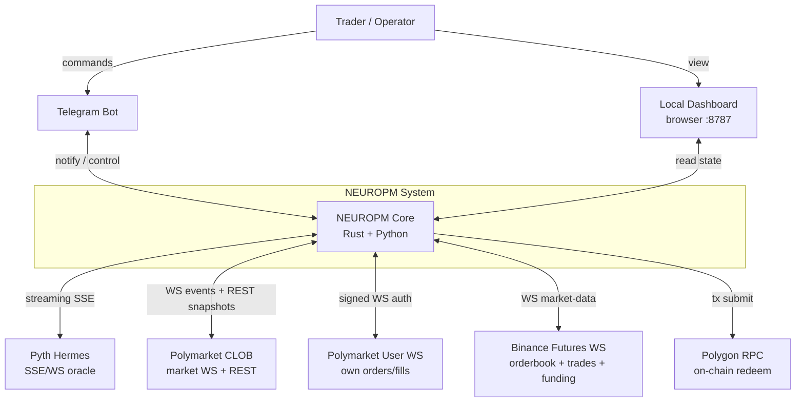
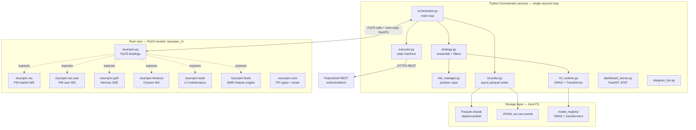
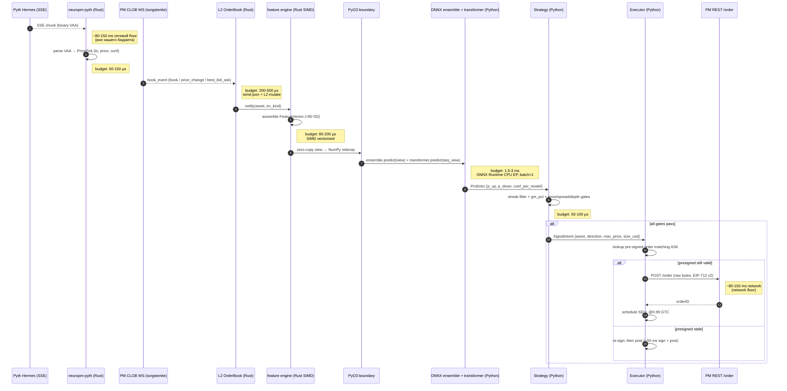
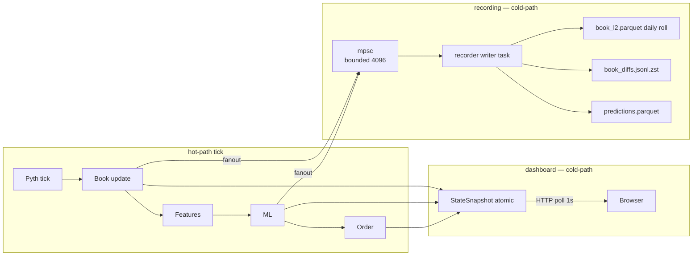
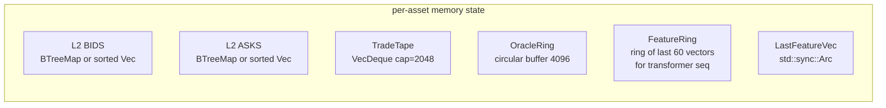
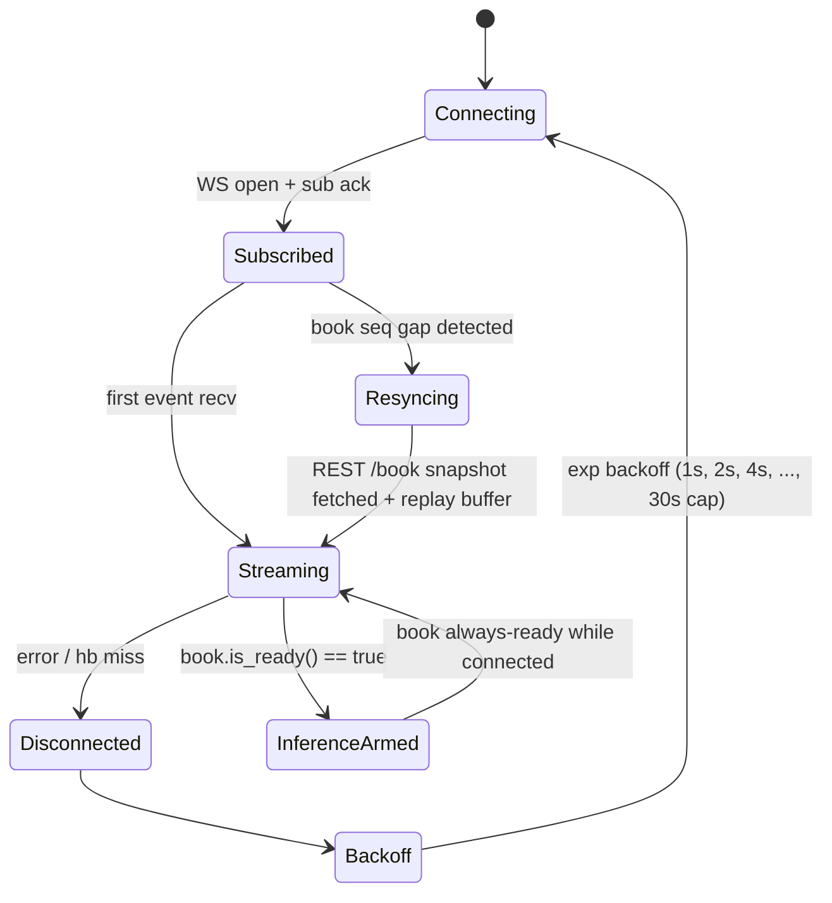
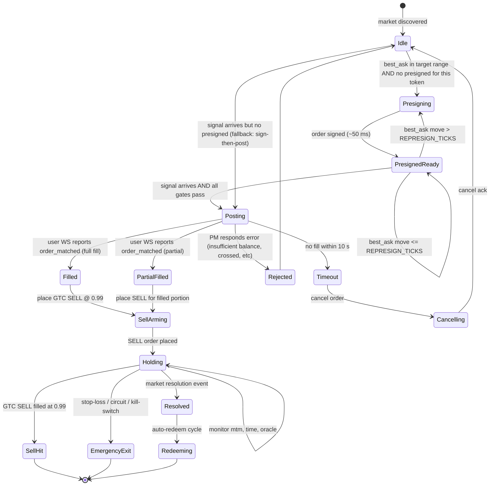

# Design Document: NEUROPM

> Полный rewrite `solana_shares_trader_v2` в high-performance ML-driven Polymarket shares trader.
> Источник истины live-поведения: `d:\AFF\AAA\POLY-DESTROYER\` (84% WR, EV $+1.86, gm0.03 sweet spot, 31 сделка по live-данным 2026-05-11..13).
> Целевой workspace: `d:\AFF\NEUROPM\`.
> Стиль документа: HLD + LLD, design-first, без кода реализации — только архитектура, контракты, формулы, инварианты.

---

## 0. Контекст и почему мы это переписываем

`solana_shares_trader_v2` накопил критическую массу архитектурного долга, который дешевле выкинуть, чем чинить. Конкретные баги, которые **не должны воспроизвестись** в NEUROPM (фиксируем письменно, чтобы было о чём биться при ревью):

| # | Файл / место | Что не так | Почему это catastrophic |
|---|---|---|---|
| L1 | `live_trader/shares_trader.py::_update_position_price` | Использует `ob["mid"]` для оценки текущей позиции | MID завышает PnL на half-spread; на иллик-маркетах mid вообще не достижим. Всё trailing-stop / dead-share логика построена на враньё. |
| L2 | `live_trader/ml_shares_trader.py::_sol_price_loop` | REST polling Pyth Hermes раз в 3s | Между тиками SOL может уйти на 10-30 bps; сигнал застревает в прошлом, gap-momentum фильтр считает фигню. |
| L3 | `live_trader/ml_shares_trader.py::_load_model` | `joblib.load` четырёх моделей на cold start, scalar Python predict | Cold-path ~3-5s, hot-path ~5-12 ms на инференс. На 200 ms тиках это уже 2.5-6% бюджета съедено только на ML. |
| L4 | `core/features/shares.py::compute_shares_features` | Чистый Python скаляр + numpy с переаллокацией на каждом тике | На WS 1s-апдейтах нормально, на event-driven 50-200 ms — узкое место. |
| L5 | `data/polymarket_collector.py::get_orderbook` | REST `/book` с TTL=10s кэшем + сортировка bids/asks на каждом вызове | PM CLOB book НЕ отсортирован. Если делать `book[0]` вместо `max(bids)` — получишь не best_bid. У нас уже это пофикшено в POLY-DESTROYER, но в v2 этой дисциплины нет. |
| L6 | `live_trader/ml_shares_trader.py::start` | Куча `asyncio` тасок без чёткого priority/cancellation/backpressure | Один тормознутый kline_loop уносит весь tick_loop в задержку. |
| L7 | `data/recorder.py` (PolymarketRecorder, sync I/O в asyncio) | `to_parquet` синхронно из event loop | Блокирует loop на десятки ms, рандомные jitter-пики. |
| L8 | `config/trading.yaml` хардкод SOL и slugs | `sol-updown-5m`, `SOLUSDT` зашиты по всему коду | Невозможно расширить на BTC/ETH/HYPE без шотгана правок. |

NEUROPM решает каждую из этих проблем явно — см. соответствующие LLD-секции (cross-ref в конце документа).

---

## 1. System Goals & Non-Goals (HLD)

### 1.1 Goals (что NEUROPM ЕСТЬ)

1. **Корректность ценообразования первым приоритетом.** Entry = ASK (то, что мы реально платим). Mark-to-market = BID (то, что мы реально получим при выходе). MID не используется нигде в production-логике — ни для PnL, ни для stop-loss, ни для exit signals. Это inviolable invariant.
2. **Latency-first.** End-to-end бюджет от Pyth tick до выставленного pre-signed ордера ≤ 25 ms p99. Конкретные пер-стейдж бюджеты — секция 7.
3. **WebSocket-only для всего, что критично.** Pyth Hermes streaming SSE/WS, Polymarket CLOB market WS, Polymarket user WS, Binance Futures WS. Никакого REST polling в hot-path. REST используется только для cold-start snapshot и для backfill после disconnect.
4. **Pyth Hermes — единственный oracle.** Polymarket резолвит через Chainlink, Chainlink под капотом тянет Pyth. Использовать Pyth напрямую = смотреть теми же глазами, что и резолюшен. Binance/Bybit оставлены **только** как microstructure-фичи (orderbook, trades, funding), не как ценовой источник для PTB / gap.
5. **ML-driven entries более частые и более точные, чем 5s.** Целевой cadence — event-driven на каждый book-update, debounced до 200 ms (10× чаще, чем сейчас). Точность держим ансамблем CatBoost + LGBM + XGBoost + RF, плюс sequence-модель (Transformer/LSTM) для tape-микроструктуры.
6. **Speed-critical компоненты на Rust** через PyO3. Python остаётся orchestrator-ом, business-logic-ом и ML inference frontend-ом. Rust — это: WS-парсинг, orderbook maintenance, feature vector assembly, ring-buffers, hot-path serialization.
7. **Records absolutely everything new.** Каждый book-snapshot, каждый WS-event, каждая ML-инференс, каждый ордер, каждый fill, каждый outcome. Append-only, daily rotation, schema-versioned. Цель — построить training-set для будущих моделей и отлаживать live-сессии postmortem без потерь.
8. **Multi-asset с первого дня.** SOL — Phase 1 (есть модели). BTC/ETH/HYPE — Phase 2 (модель тренируется на накопленных recorded data). `Asset` — first-class abstraction; никакого `if asset == "SOL"` в hot-path.
9. **Native Windows deployment.** Никаких docker-only вещей, никаких POSIX-only трюков (eg. `os.fork`, raw `epoll`). `tokio` + `asyncio` работают на Windows; именно поэтому выбраны.
10. **Self-contained.** Никаких внешних DB / message-queue для MVP. Локальные Parquet + JSONL + in-process Arrow ring-buffers. БД появляется только когда мы упрёмся в одно из: (а) >50 GB recorded data в день, (б) multi-process / multi-machine setup, (в) need для cross-session ad-hoc queries чаще, чем раз в день.

### 1.2 Non-Goals (что NEUROPM НЕ ЕСТЬ — явно)

- **НЕ market-maker.** Мы не котируем двусторонне, не ловим maker-rebate как первичную стратегию. Maker-режим (GTC limit) используется как способ дёшево войти в ASK, не как способ зарабатывать на спреде.
- **НЕ HFT в смысле sub-millisecond co-location.** PM CLOB не даёт co-location, sequencer на us-east, REST/WS round-trip из Москвы/EU ~80-150 ms. Бороться за каждые 100 µs внутри нашего процесса бессмысленно, пока сетевой floor 100 ms. Цель — оптимально использовать те 100 ms, не быть ультра-низколатентным узлом.
- **НЕ universal exchange adapter.** Мы интегрируем строго: Polymarket CLOB v2, Pyth Hermes, Binance Futures WS. Любая абстракция типа CCXT — over-engineering для нашего scope.
- **НЕ migration tool.** Старые parquet/recorded data из v2 НЕ импортируются (явный ответ user на вопрос #10). Schema другая, модели другие, шум другой.
- **НЕ DEX aggregator / smart router.** Один venue — Polymarket CLOB. Hedging на Binance остаётся опцией для будущего, но не входит в первый релиз.
- **НЕ proof-assistant verified system.** Используем property-based testing (Hypothesis / proptest) для invariants. Формальную верификацию (Lean/TLA+) применяем точечно к pricing-формулам, если решим, что окупается. По умолчанию — нет.

---

## 2. Architecture Overview (HLD, C4-style)

### 2.1 System Context (C4 Level 1)



### 2.2 Container Diagram (C4 Level 2)



### 2.3 Component Diagram (C4 Level 3) — внутренности Rust core

```mermaid
graph LR
    subgraph WSL[WS layer]
        TungPM[tungstenite client<br/>PM market]
        TungU[tungstenite client<br/>PM user]
        ReqwSSE[reqwest-eventsource<br/>Pyth Hermes]
        TungBin[tungstenite client<br/>Binance Futures]
    end

    subgraph PARSE[Parsers]
        SimdJ[simd-json parser]
        VAA[Pyth VAA binary decoder]
        BinJ[Binance combined-stream JSON]
    end

    subgraph STATE[State / Memory]
        L2[L2 OrderBook<br/>BTreeMap or sorted Vec]
        Ring[Arrow RingBuffer<br/>per asset]
        Tape[TradeTape<br/>fixed-size deque]
    end

    subgraph FEATX[Feature engine]
        Shares[shares features 16]
        Micro[microstructure 30-50]
        Oracle[oracle features 8]
        Vec[FeatureVector<br/>repr(C) f32 slab]
    end

    subgraph FFI[PyO3 boundary]
        Sub[on_book_event subscribe]
        Pred[get_features_view -> &[f32]]
        Place[submit_signed_order]
    end

    TungPM --> SimdJ --> L2
    TungBin --> BinJ --> Tape
    ReqwSSE --> VAA --> Ring
    L2 --> Shares
    Tape --> Micro
    Ring --> Oracle
    Shares --> Vec
    Micro --> Vec
    Oracle --> Vec
    Vec --> Pred
    L2 --> Sub
    TungU --> SimdJ --> Place
```


---

## 3. Data Flow — Tick Lifecycle (HLD)

Самый горячий путь системы — от oracle update до posted order. Все остальные потоки (recording, dashboard) живут вне этого критического пути.

### 3.1 Sequence Diagram — happy path entry



### 3.2 End-to-end latency budget (single tick)

Числа — целевые p99 на Windows-native dev box, AMD/Intel CPU 2022+, NVMe SSD. Сетевой floor (Pyth → нас, нас → PM) **исключён** из in-process бюджета и проходит как отдельная статья.

| # | Стейдж | Целевой бюджет p99 | Где живёт | Чем меряется |
|---|---|---|---|---|
| S0 | Pyth SSE chunk arrival → процесс | сетевой floor (вне бюджета) | OS / network | n/a |
| S1 | VAA parse + sanity check | **≤ 150 µs** | Rust `neuropm-pyth` | `tracing` span |
| S2 | PM WS message recv → simd-json parsed | **≤ 250 µs** | Rust `neuropm-ws` | span |
| S3 | OrderBook L2 incremental update | **≤ 500 µs** | Rust `neuropm-book` | span |
| S4 | Feature vector assembly (≈80 features) | **≤ 200 µs** | Rust `neuropm-feats` SIMD | span |
| S5 | PyO3 boundary cross + NumPy view | **≤ 50 µs** | `neuropm-py` | span |
| S6 | Ensemble inference (CB+LGBM+XGB+RF, ONNX) | **≤ 1.5 ms** | Python ONNX Runtime | `time.perf_counter_ns` |
| S7 | Transformer inference (60×N seq → prob) | **≤ 1.5 ms** | Python ONNX Runtime | span |
| S8 | Strategy gates (streak, gm, depth, spread) | **≤ 100 µs** | Python | span |
| S9 | Executor decision + presigned lookup | **≤ 100 µs** | Python | span |
| S10 | POST /order to PM REST (signed bytes) | сетевой floor 80-150 ms | OS / network | n/a |
| **Sum (in-process)** | **S1..S9** | **≤ 4.5 ms p99** | — | aggregated |
| **Sum (incl. network)** | S0+S1..S10 | **≈ 200-300 ms p99** | — | wall-clock from `tick_recv_ts` |

Отдельные пред-условия:
- ONNX-модели pre-warmed at startup (минимум 50 dummy inferences) — иначе первый predict 30-80 ms.
- `tokio` runtime с `worker_threads = max(2, num_cpus / 2)`. WS клиенты на одном dedicated runtime; feature engine — на shared.
- Python GIL: длинных Python-операций в hot-path нет. ONNX Runtime отпускает GIL внутри `Run()`; следовательно, transformer и ensemble могут идти параллельно (см. S6 / S7 идут одновременно, не sequentially — это даёт ~1.5 ms комбинированно, не 3 ms).

### 3.3 Cold-path flows

Вне hot-path (но всё равно в системе):



Backpressure policy в recorder mpsc:
- channel cap 4096 events per writer.
- Если `try_send` блокируется → **drop oldest book_diff**, **never drop predictions/fills/orders/outcomes**.
- Метрика `recorder.dropped_book_diffs_total` экспонируется в dashboard.

---

## 4. Module Structure (HLD)

Полное дерево `d:\AFF\NEUROPM\`. Rust crates и Python пакеты разделены физически — Rust живёт в `rust/`, Python в `python/`. Build artifacts Rust (PyO3-модуль) кладутся в `python/neuropm/_native/` через maturin develop.

```
d:\AFF\NEUROPM\
├── .kiro\
│   └── specs\neuropm\
│       ├── .config.kiro
│       ├── design.md           ← этот документ
│       ├── requirements.md     (deriv'нутся из design)
│       └── tasks.md            (последняя фаза)
├── .env                        # PRIVATE_KEY, PROXY_WALLET, TG_TOKEN
├── .env.example
├── .gitignore
├── README.md
├── pyproject.toml              # Python build: hatchling + maturin backend
├── Cargo.toml                  # Rust workspace root
├── rust-toolchain.toml         # pin: stable 1.79+
│
├── rust\
│   ├── Cargo.lock
│   ├── neuropm-core\           # FFI types, Asset trait, Money primitives
│   │   ├── Cargo.toml
│   │   └── src\
│   │       ├── lib.rs
│   │       ├── asset.rs        # Asset enum + AssetSpec
│   │       ├── money.rs        # Price, Size, Usd — newtypes (no f64 mixups)
│   │       ├── tick.rs         # PriceTick, OrderbookSnapshot
│   │       ├── feature_vec.rs  # #[repr(C)] FeatureVector slab
│   │       └── error.rs
│   ├── neuropm-ws\             # PM CLOB market WS client
│   │   ├── Cargo.toml          # tungstenite + simd-json + tokio
│   │   └── src\lib.rs
│   ├── neuropm-ws-user\        # PM user WS (auth + own fills)
│   ├── neuropm-pyth\           # Pyth Hermes SSE + VAA decoder
│   │   ├── Cargo.toml          # reqwest-eventsource + pyth-sdk-rs
│   │   └── src\
│   │       ├── lib.rs
│   │       ├── sse.rs
│   │       └── vaa.rs
│   ├── neuropm-binance\        # Binance Futures WS (microstructure only)
│   ├── neuropm-book\           # L2 maintenance, lock-free per-token
│   │   ├── Cargo.toml          # parking_lot + smallvec
│   │   └── src\
│   │       ├── lib.rs
│   │       ├── book.rs         # OrderBook<Side>
│   │       └── replay.rs       # apply event sequence (for tests)
│   ├── neuropm-feats\          # SIMD feature engine
│   │   ├── Cargo.toml          # ndarray + wide (SIMD)
│   │   └── src\
│   │       ├── lib.rs
│   │       ├── shares.rs       # 16 shares features
│   │       ├── micro.rs        # 30-50 microstructure
│   │       ├── oracle.rs       # 8 oracle-derived
│   │       └── assemble.rs     # FeatureVector composer
│   └── neuropm-py\             # PyO3 module (the only public surface)
│       ├── Cargo.toml          # pyo3 + numpy
│       └── src\
│           ├── lib.rs          # #[pymodule]
│           ├── pm_ws.rs        # exposes PMMarketWs class
│           ├── pyth.rs         # exposes PythStream class
│           ├── book.rs         # exposes OrderBookHandle
│           └── feats.rs        # exposes FeatureEngine
│
├── python\
│   ├── neuropm\
│   │   ├── __init__.py
│   │   ├── _native\            # built by maturin develop
│   │   │   └── neuropm_rs.pyd
│   │   ├── config\
│   │   │   ├── __init__.py
│   │   │   ├── loader.py       # TOML loader + per-asset merge
│   │   │   ├── settings.toml   # global: paths, logging, infra URLs
│   │   │   ├── trading.toml    # global trade defaults
│   │   │   └── assets\
│   │   │       ├── sol.toml    # SOL slugs, model id, gates
│   │   │       ├── btc.toml    # placeholder Phase 2
│   │   │       ├── eth.toml    # placeholder Phase 2
│   │   │       └── hype.toml   # placeholder Phase 2
│   │   ├── domain\
│   │   │   ├── __init__.py
│   │   │   ├── asset.py        # AssetSpec dataclass (Python mirror of Rust)
│   │   │   ├── pricing.py      # entry_price, mark_to_market, vwap_fill
│   │   │   ├── pnl.py          # realized + mtm + at-resolution
│   │   │   └── market.py       # MarketSnapshot, neg_risk symmetry
│   │   ├── runtime\
│   │   │   ├── __init__.py
│   │   │   ├── orchestrator.py # main asyncio loop
│   │   │   ├── ws_supervisor.py# WS reconnect / backfill
│   │   │   ├── tick_pump.py    # event-driven debounced inference trigger
│   │   │   └── clock.py        # monotonic + UTC, tested
│   │   ├── ml\
│   │   │   ├── __init__.py
│   │   │   ├── runtime.py      # ONNX Runtime sessions, warmup
│   │   │   ├── ensemble.py     # cb+lgbm+xgb+rf weighted average
│   │   │   ├── transformer.py  # tape sequence model
│   │   │   ├── calibration.py  # isotonic / Platt
│   │   │   └── registry.py     # model_registry path resolution
│   │   ├── strategy\
│   │   │   ├── __init__.py
│   │   │   ├── base.py         # StrategyProtocol
│   │   │   ├── ensemble_streak.py  # POLY-DESTROYER active strategy
│   │   │   ├── filters.py      # streak, gap_momentum, price/spread gates
│   │   │   └── sizing.py       # fixed / kelly-fraction
│   │   ├── execution\
│   │   │   ├── __init__.py
│   │   │   ├── executor.py     # state machine
│   │   │   ├── presigner.py    # GTC pre-sign cache
│   │   │   ├── auto_redeem.py  # claim resolved positions
│   │   │   └── clob_client.py  # py-clob-client-v2 wrapper
│   │   ├── recording\
│   │   │   ├── __init__.py
│   │   │   ├── recorder.py     # async fanout writer
│   │   │   ├── schemas.py      # parquet schema versions
│   │   │   ├── parquet_writer.py
│   │   │   └── jsonl_writer.py # zstd-compressed
│   │   ├── risk\
│   │   │   ├── __init__.py
│   │   │   └── manager.py      # caps, kill-switch, daily-loss
│   │   ├── dashboard\
│   │   │   ├── __init__.py
│   │   │   ├── server.py       # FastAPI :8787
│   │   │   ├── state.py        # snapshotable state
│   │   │   └── static\         # tiny HTML/JS, no react
│   │   ├── telegram\
│   │   │   ├── __init__.py
│   │   │   └── bot.py
│   │   ├── training\
│   │   │   ├── __init__.py
│   │   │   ├── dataset.py      # from data/recorded → X,y
│   │   │   ├── train_classical.py  # cb/lgbm/xgb/rf
│   │   │   ├── train_transformer.py
│   │   │   ├── walk_forward.py
│   │   │   └── export_onnx.py  # convert any model → ONNX
│   │   ├── backtest\
│   │   │   ├── __init__.py
│   │   │   ├── replay_engine.py    # replay recorded WS events deterministically
│   │   │   ├── fill_simulator.py   # VWAP fill on recorded ask depth
│   │   │   └── metrics.py
│   │   ├── cli\
│   │   │   ├── __init__.py
│   │   │   └── main.py             # `python -m neuropm <subcommand>`
│   │   └── utils\
│   │       ├── logger.py
│   │       └── ringbuffer.py
│   └── tests\
│       ├── unit\
│       │   ├── test_pricing.py
│       │   ├── test_pnl.py
│       │   └── test_filters.py
│       ├── property\
│       │   ├── test_pricing_props.py   # Hypothesis
│       │   └── test_book_replay.py
│       ├── integration\
│       │   ├── test_replay_smoke.py
│       │   └── test_executor_state.py
│       └── fixtures\
│           └── recorded_sample\
│
├── data\
│   ├── recorded\
│   │   └── {asset}\{YYYY-MM-DD}\
│   │       ├── book_l2.parquet
│   │       ├── book_diffs.jsonl.zst
│   │       ├── oracle_ticks.parquet
│   │       ├── cex_microstructure.parquet
│   │       ├── predictions.parquet
│   │       ├── orders.jsonl
│   │       ├── fills.jsonl
│   │       ├── outcomes.jsonl
│   │       └── session_meta.json
│   ├── model_registry\
│   │   └── {asset}\
│   │       ├── latest -> 20260601_120000\
│   │       └── 20260601_120000\
│   │           ├── ensemble_cb.onnx
│   │           ├── ensemble_lgbm.onnx
│   │           ├── ensemble_xgb.onnx
│   │           ├── ensemble_rf.onnx
│   │           ├── transformer.onnx
│   │           ├── calibration.json
│   │           ├── feature_spec.json
│   │           └── meta.json
│   ├── results\
│   │   ├── live\{session_id}\
│   │   └── backtest\{run_id}\
│   └── logs\
│       └── neuropm.log
│
└── scripts\
    ├── dev_setup.ps1           # maturin develop + venv bootstrap
    ├── run_live.ps1
    ├── run_record_only.ps1
    ├── run_backtest.ps1        # replay engine driver
    └── train.ps1
```

---

## 5. Process Topology (HLD)

### 5.1 One process, many tasks — обоснование

**Решение: single OS process, single Python `asyncio` event loop, dedicated `tokio` runtime in Rust, no `multiprocessing`.**

Аргументы:

1. **Windows-native + `multiprocessing` плохо дружат.** `fork()` отсутствует, `spawn` стартует ~300-800 ms нового процесса; для бота, который должен реагировать за 25 ms in-process, добавление IPC только ради «изоляции» — чистая потеря латенси.
2. **Python GIL не блокирует Rust.** Все hot-path операции (WS parse, book maintenance, feature assembly) идут под `tokio` без GIL. PyO3 явно отпускает GIL в `Python::allow_threads` для blocking-секций.
3. **ONNX Runtime отпускает GIL** во время `Run()`. То есть инференс ensemble и transformer могут параллелиться через `asyncio.to_thread` без `multiprocessing`.
4. **Recorder I/O** → отдельный `asyncio.Task` + bounded mpsc `asyncio.Queue` или `tokio::mpsc` (для Rust-side fanout). Parquet writes идут через `pyarrow.parquet` в `to_thread` (writes ≈ 1-30 ms, не критично).
5. **Dashboard** — `uvicorn` в том же loop. FastAPI serves `/api/state` snapshot, который читается атомарно из общего `StateRegistry`. 1s polling browser = zero impact на hot-path.

### 5.2 Карта тасков

| Task | Runtime | Where it lives | Period / trigger | Cancellation domain |
|---|---|---|---|---|
| `pyth_stream_task` | tokio (Rust) | `neuropm-pyth` | event-driven SSE | per-asset |
| `pm_market_ws_task` | tokio (Rust) | `neuropm-ws` | event-driven WS | per-token_id |
| `pm_user_ws_task` | tokio (Rust) | `neuropm-ws-user` | event-driven WS | global |
| `binance_ws_task` | tokio (Rust) | `neuropm-binance` | event-driven WS | per-symbol |
| `book_apply_task` | tokio (Rust) | `neuropm-book` | per-message | per-token_id |
| `feature_emit_task` | tokio (Rust) | `neuropm-feats` | debounced 200 ms / book-event | per-asset |
| `tick_pump_task` | asyncio (Python) | `runtime/tick_pump.py` | callback from Rust | per-asset |
| `inference_task` | asyncio + thread-pool | `ml/runtime.py` | per-tick | per-asset |
| `strategy_task` | asyncio | `strategy/...` | per-prediction | per-asset |
| `executor_task` | asyncio | `execution/executor.py` | per-signal | global |
| `presigner_task` | asyncio | `execution/presigner.py` | every 1s + on best_ask move | per-token_id |
| `auto_redeem_task` | asyncio | `execution/auto_redeem.py` | every 120s | global |
| `recorder_writer_task` | asyncio | `recording/recorder.py` | drain mpsc | global, last-to-die |
| `dashboard_server` | asyncio (uvicorn) | `dashboard/server.py` | HTTP requests | global |
| `telegram_bot_task` | asyncio | `telegram/bot.py` | events | global |
| `clock_drift_monitor` | asyncio | `runtime/clock.py` | every 10s | global |

Cancellation contract: при shutdown сначала отменяются ВСЕ задачи КРОМЕ `recorder_writer_task` и `executor_task`; даём executor `flush_grace_s = 5` для отмены open orders; recorder затем дренирует mpsc до конца (deadline 30s) и закрывает parquet writers корректно. Это предотвращает потерю последних predictions/fills.

---

## 6. Storage Architecture (HLD)

### 6.1 Решение: Parquet (cold) + JSONL.zst (raw events) + Arrow ring (hot in-mem)

| Stream | Format | Path | Roll | Compression | Why this format |
|---|---|---|---|---|---|
| L2 book snapshots (1s granularity) | Parquet | `data/recorded/{asset}/{date}/book_l2.parquet` | daily | snappy | columnar, fast scan for training, <100 µs append latency batched |
| Raw WS events (book/price_change/best_bid_ask) | JSONL.zst | `book_diffs.jsonl.zst` | daily, 256 MB cap | zstd-3 | append-only, tiny per-line overhead, replayable byte-for-byte |
| Pyth oracle ticks | Parquet | `oracle_ticks.parquet` | daily | snappy | low cardinality, columnar wins |
| Binance microstructure | Parquet | `cex_microstructure.parquet` | daily | snappy | same |
| ML predictions (every inference) | Parquet | `predictions.parquet` | daily | snappy | training-ready, joinable with outcomes |
| Own orders | JSONL | `orders.jsonl` | session | none | small volume, human-readable for postmortem |
| Own fills | JSONL | `fills.jsonl` | session | none | same |
| Market outcomes (resolutions) | JSONL | `outcomes.jsonl` | daily | none | tiny, append-only ground truth |
| Session metadata | JSON | `session_meta.json` | per session | none | config snapshot, schema versions, git SHA |

### 6.2 Hot in-memory layout (per asset)



Все эти структуры живут в Rust, доступ из Python — через `&[f32]` (zero-copy NumPy view), безопасно благодаря lifetime + `Arc`.

### 6.3 Почему НЕ DB для MVP

| Кандидат | Почему НЕ берём сейчас | Когда возьмём |
|---|---|---|
| Postgres / Timescale | Нужен сервер, бэкап, vacuum. Hot-path write latency не подходит. | Когда recorded > 50 GB/день и нужны cross-day аналитические запросы чаще, чем 1×/день |
| ClickHouse | Жирно на одной машине, лучше для analytics-on-batch. | Когда захочется live-аналитику с фильтрами по миллионам тиков |
| Redis | Persistence — вопрос, не append-only. | Не нужен — у нас нет распределённой координации |
| Kafka | Overkill для single-process system. | Когда trader → multi-process / multi-machine |

Триггеры для миграции на БД: см. self-critique секцию (трейд-офф «no-DB» honest).

### 6.4 Schema versioning

Каждая Parquet-схема привязана к `schema_version: u16`, которая инкрементируется при breaking change. `session_meta.json` фиксирует версии всех потоков. Backwards-compat reader живёт в `recording/schemas.py`.

---

## 7. Configuration Model (HLD)

### 7.1 Решение: TOML (NOT YAML)

Причины:
- TOML — строгий синтаксис, нет yaml-style "Norway problem" (`NO` парсится в bool в YAML).
- Pyhon stdlib `tomllib` (3.11+) встроен, нагрузка zero.
- Rust `toml` crate качественный, единый формат для обоих языков.

### 7.2 Иерархия

```
neuropm.toml (root, optional override)
└── settings.toml (global infra, paths, logging)
    └── trading.toml (global trade defaults)
        └── assets/{asset}.toml (per-asset overrides)
```

Загрузка: `loader.load(env="prod" | "dev")` мерджит в порядке `settings → trading → asset → env-overrides`. `pydantic` v2 модели валидируют итог. Нет неявных дефолтов — всё, что используется в коде, должно быть в `pydantic` модели с явным дефолтом или `required`.

### 7.3 Схема (упрощённая, в TOML notation)

```toml
# settings.toml
[infra.polymarket]
clob_host = "https://clob.polymarket.com"
gamma_host = "https://gamma-api.polymarket.com"
ws_market_url = "wss://ws-subscriptions-clob.polymarket.com/ws/market"
ws_user_url = "wss://ws-subscriptions-clob.polymarket.com/ws/user"
chain_id = 137

[infra.pyth]
hermes_url = "https://hermes.pyth.network"
sse_path = "/v2/updates/price/stream"

[infra.binance]
ws_url = "wss://fstream.binance.com"
streams = ["bookTicker", "depth20@100ms", "aggTrade", "markPrice@1s"]

[paths]
data_dir = "data"
recorded_dir = "data/recorded"
model_registry_dir = "data/model_registry"
logs_dir = "data/logs"

[logging]
level = "INFO"
file_rotation_mb = 64
retention_days = 30

[runtime]
worker_threads = 0   # 0 → max(2, num_cpus / 2)
inference_debounce_ms = 200
```

```toml
# trading.toml — global trade defaults
[execution]
order_size_usd = 2.85
max_open_positions = 5
use_ask_price = true       # invariant: always true; explicit for documentation
auto_takeprofit_at = 0.99  # GTC SELL placed after fill

[recording]
enabled = true
book_snapshot_interval_ms = 1000
backpressure_drop_oldest_book_diffs = true
never_drop_streams = ["predictions", "orders", "fills", "outcomes"]

[risk]
daily_loss_limit_usd = 50.0
kill_switch_consecutive_losses = 8
max_inventory_usd_per_asset = 30.0
```

```toml
# assets/sol.toml — per-asset
asset = "SOL"
enabled = true

[market]
slugs = ["sol-updown-5m", "sol-updown-15m"]
durations_min = [5, 15]

[oracle]
pyth_price_id = "0xef0d8b6fda2ceba41da15d4095d1da392a0d2f8ed0c6c7bc0f4cfac8c280b56d"

[cex_microstructure]
binance_symbol = "SOLUSDT"

[model]
registry_id = "sol/latest"
primary = "catboost"          # active model for entry decisions
ensemble = ["catboost", "lgbm", "xgboost", "rf"]
transformer_enabled = true

[entry]
min_confidence = 0.85
min_share_price = 0.40
max_share_price = 0.55
min_entry_pct = 0.00
max_entry_pct = 0.95
max_spread = 0.08
min_depth_shares = 20
streak_required = 2
streak_interval_s = 5
gap_min_pct = 0.03
```

```toml
# assets/btc.toml — Phase 2 placeholder
asset = "BTC"
enabled = false
[market]
slugs = ["btc-updown-5m", "btc-updown-1h"]
durations_min = [5, 60]
[oracle]
pyth_price_id = "0xe62df6c8b4a85fe1a67db44dc12de5db330f7ac66b72dc658afedf0f4a415b43"
[cex_microstructure]
binance_symbol = "BTCUSDT"
[model]
registry_id = "btc/latest"
[entry]
# inherits trading.toml defaults until tuned
```

### 7.4 Validation rules

- Любой `enabled = true` asset обязан иметь `model.registry_id` валидно резолвящимся в `data/model_registry/...`.
- Все `pyth_price_id` валидируются на 32-byte hex.
- `min_share_price < max_share_price`, `min_entry_pct < max_entry_pct` — invariants в `pydantic.model_validator`.
- При попытке стартовать с `BTC.enabled=true`, но без `data/model_registry/btc/latest/` — fail-fast c понятной ошибкой.

---

## 8. Multi-Asset Abstraction (HLD)

Самое опасное место для архитектурной грязи — захардкодить SOL. Решение: `Asset` как first-class объект, проходящий через все слои.

### 8.1 Rust-side: `Asset` enum + `AssetSpec`

Концептуально (синтаксис близкий к Rust):

```pascal
ENUM Asset
  VARIANT Sol
  VARIANT Btc
  VARIANT Eth
  VARIANT Hype
END ENUM

STRUCTURE AssetSpec
  asset:                Asset
  pyth_price_id:        [u8; 32]
  binance_symbol:       SmallString
  pm_market_slugs:      Vec<SmallString>     // sol-updown-5m, sol-updown-15m
  durations_min:        Vec<u16>
  feature_spec_version: u16                   // freezes feature ordering
END STRUCTURE
```

Все Rust-структуры (OrderBook, FeatureVector, PriceTick) параметризованы по `Asset` (`OrderBook<Sol>`-style not используется, потому что monomorphization × 4 раздувает binary; вместо этого Asset — runtime-tag, т.к. workload идентичен по shape).

### 8.2 Python-side mirror

`domain/asset.py`:

```pascal
STRUCTURE AssetSpec
  asset:                Literal["SOL", "BTC", "ETH", "HYPE"]
  pyth_price_id:        bytes        # 32 bytes
  binance_symbol:       str
  pm_market_slugs:      list<str>
  durations_min:        list<int>
  model_registry_path:  Path
  feature_spec_version: int
END STRUCTURE
```

Загружается из TOML, валидируется `pydantic`, передаётся в Rust через `PyO3` как opaque handle.

### 8.3 Композиция без дупликации

Все per-asset state хранится в `dict[Asset, X]` контейнерах (Python) или `HashMap<Asset, X>` (Rust). Ни одна функция в `runtime/`, `strategy/`, `execution/`, `recording/` не принимает строку `"SOL"` — только `AssetSpec` или `Asset`.

Exception: TOML конфиги используют строки — это корректно, т.к. сериализация. Конвертация в типизированные значения происходит ровно один раз в `config/loader.py`.

### 8.4 Стратегия и модели

Стратегия не знает про конкретный asset, только про `AssetSpec` и `MarketSnapshot`. Модель нагружается через `registry.load(asset_spec.model_registry_path)` — отдельный `OnnxSession` per asset. Ансамбль и транформер живут в `dict[Asset, ModelBundle]`.

### 8.5 Phase plan

| Phase | Когда | Что включено |
|---|---|---|
| Phase 1 (MVP) | release week 1 | SOL trade + record + dashboard + presigner. BTC/ETH/HYPE — `enabled=false`, slot готов. |
| Phase 1.5 | week 2-3 | Recorder для BTC/ETH/HYPE начинает копить data (без trade). |
| Phase 2 | как только recorded > 7 days × 1+ asset | Train model BTC, enable trade. Repeat for ETH, HYPE. |
| Phase 3 | future | Cross-asset signal sharing (e.g. BTC microstructure → SOL entry confidence). Не входит в design сейчас. |

---

## 9. Performance Budget Table — расширенный (HLD)

Уже частично в §3.2; здесь сводная таблица по типам операций, с обоснованием выбранных лимитов.

| Operation | Target p50 | Target p99 | Hard limit | Why this number |
|---|---|---|---|---|
| Pyth VAA decode | 50 µs | 150 µs | 500 µs | binary parse one priceUpdate, single allocation reuse |
| PM WS message → parsed | 100 µs | 250 µs | 1 ms | simd-json on ~1-4 KB JSON |
| L2 incremental update | 150 µs | 500 µs | 2 ms | sorted Vec insertion at right side, ~10-100 levels |
| Feature assembly (full vector) | 80 µs | 200 µs | 1 ms | SIMD f32 ops on cached state, no allocation |
| PyO3 boundary cross | 20 µs | 50 µs | 200 µs | argument marshalling, NumPy view creation |
| Ensemble ONNX (4 trees, batch=1) | 800 µs | 1.5 ms | 5 ms | CPU EP, pre-warmed sessions |
| Transformer ONNX (60×N seq) | 800 µs | 1.5 ms | 5 ms | small model (2 layers), CPU EP |
| Calibration (isotonic per model) | 5 µs | 15 µs | 100 µs | numpy lookup |
| Strategy gates | 30 µs | 100 µs | 500 µs | pure Python conditions |
| Presigned lookup | 20 µs | 50 µs | 200 µs | dict[token_id] + freshness check |
| EIP-712 sign (when re-signing) | 20 ms | 50 ms | 100 ms | py-clob-client v2 path; this is why we presign |
| POST /order to PM | 80 ms | 150 ms | 400 ms | network floor; outside our control |
| Parquet append (book snapshot) | 1 ms | 5 ms | 30 ms | batched in writer thread, not on hot-path |

Где меряем: каждый стейдж эмитит `tracing` span (Rust) или `time.perf_counter_ns()` (Python). Метрики агрегируются в `StateRegistry` и доступны через dashboard `/api/metrics`.

Бюджет НЕ соблюдён → автоматический warning в Telegram. Бюджет НЕ соблюдён 3 раза подряд для одного стейджа → kill-switch (escalation policy в `risk/manager.py`).

---

## 10. Failure Model & Degradation (HLD)

Каждый внешний компонент имеет три состояния: **healthy / degraded / dead**, и для каждого определена политика.

| Component | Healthy | Degraded | Dead | Action on dead |
|---|---|---|---|---|
| Pyth Hermes SSE | tick gap < 1s | gap 1-5s | gap > 5s | **STOP all entries**, mark current positions as "stale-oracle", switch to mark-to-bid only, alert TG |
| PM CLOB market WS | event gap < 3s | 3-10s | > 10s | reconnect with exp backoff; if reconnected, fetch full REST snapshot before resuming inference |
| PM user WS | heartbeat ok | missing 1 hb | missing 3 hb | reconnect; pending fills tracked via REST `/orders` poll |
| Binance Futures WS | ok | gap 5-30s | gap > 30s | feature engine continues on stale CEX features for 60s; after — disable features that depend on CEX, downgrade ensemble (drop microstructure-heavy models from voting) |
| ONNX inference NaN/Inf | n/a | first occurrence | repeating | **skip this tick**; if 5 consecutive — disable that model in ensemble for session; alert |
| Recorder mpsc full | < 50% | 50-90% | 100% | drop oldest book_diff; never drop predictions/fills/orders/outcomes; alert at 90% |
| Polygon RPC (auto-redeem) | resp ok | timeout 1× | 3× consecutive | retry with backoff; non-critical for trading; re-attempt at next 120s tick |
| Disk space (data dir) | > 10 GB free | 1-10 GB | < 1 GB | rotate aggressive (compress yesterday immediately); refuse new writes if < 100 MB |

### 10.1 Circuit breakers

- **Daily loss circuit:** cumulative realised PnL < `-daily_loss_limit_usd` → halt all entries, keep only exit logic alive.
- **Consecutive-loss circuit:** N consecutive losing trades (cfg `kill_switch_consecutive_losses=8`) → halt entries 1h.
- **Latency circuit:** p99 in-process latency > 4× target for 30s → halt entries until recovery.
- **Oracle-skew circuit:** |Pyth - Binance| > 0.5% for >10s → flag potential oracle attack, halt entries.

### 10.2 Reconnect protocol (PM market WS)



**Critical rule:** inference task субъекту блокируется (no entries) пока `book.is_ready() == false`. `is_ready` означает: получен initial snapshot ИЛИ соединение восстановлено и снапшот пере-фетчнут.


---

# Low-Level Design (LLD)

---

## 11. Rust Crates Layout (LLD)

### 11.1 Workspace `Cargo.toml` (root)

```toml
[workspace]
resolver = "2"
members = [
  "rust/neuropm-core",
  "rust/neuropm-ws",
  "rust/neuropm-ws-user",
  "rust/neuropm-pyth",
  "rust/neuropm-binance",
  "rust/neuropm-book",
  "rust/neuropm-feats",
  "rust/neuropm-py",
]

[workspace.dependencies]
tokio = { version = "1.40", features = ["rt-multi-thread", "macros", "sync", "time", "net"] }
tracing = "0.1"
tracing-subscriber = { version = "0.3", features = ["env-filter"] }
thiserror = "1"
anyhow = "1"
smallvec = "1.13"
parking_lot = "0.12"
ahash = "0.8"
serde = { version = "1", features = ["derive"] }
simd-json = "0.13"
tungstenite = { version = "0.23", features = ["native-tls"] }
tokio-tungstenite = { version = "0.23", features = ["native-tls"] }
reqwest = { version = "0.12", features = ["json", "stream"] }
reqwest-eventsource = "0.6"
ndarray = "0.16"
wide = "0.7"               # SIMD f32x8
zstd = "0.13"
arrow = { version = "52", default-features = false, features = ["ipc"] }
pyo3 = { version = "0.22", features = ["extension-module", "abi3-py311"] }
numpy = "0.22"
```

### 11.2 Crate `neuropm-core` — fundamentals + FFI types

**Purpose:** общие типы, не зависящие от runtime и от Python. Фундамент. Все остальные crates тянут только это.

Cargo.toml deps: `serde`, `smallvec`, `thiserror`, `ahash`.

Ключевые типы (Pascal-pseudocode):

```pascal
ENUM Asset
  Sol, Btc, Eth, Hype
END ENUM

NEWTYPE Price = u32          // ticks of 0.0001 USD; 0..=10_000 valid
NEWTYPE Size  = u64          // shares × 10^4 (4 decimals)
NEWTYPE Usd   = i64          // 6 decimals — same as USDC

#[repr(C)]
STRUCTURE PriceTick
  asset:        Asset
  ts_recv_ns:   u64           // monotonic ns since process start
  ts_oracle_ms: u64           // Pyth publish time (UTC ms)
  price:        f64           // SOL=USD, BTC=USD, ...
  conf_pct:     f32           // Pyth confidence interval as fraction of price
END STRUCTURE

#[repr(C)]
STRUCTURE OrderBookLevel
  price: Price
  size:  Size
END STRUCTURE

#[repr(C)]
STRUCTURE OrderBookSnapshot
  token_id:    [u8; 32]                 // PM CLOB tokenId hex → bytes
  asset:       Asset
  ts_recv_ns:  u64
  seq_no:      u64                      // PM event seq
  bids_len:    u16                      // up to ~100 in practice
  asks_len:    u16
  bids:        [OrderBookLevel; MAX_LEVELS]
  asks:        [OrderBookLevel; MAX_LEVELS]
END STRUCTURE

CONST FEATURE_DIM = 80                  // pinned per feature_spec_version

#[repr(C)]
STRUCTURE FeatureVector
  asset:           Asset
  ts_ns:           u64
  schema_version:  u16
  values:          [f32; FEATURE_DIM]   // ordering pinned by feature_spec.json
END STRUCTURE

ENUM NeuropmError
  Disconnect, ParseFail, BookOutOfOrder, FeatureNan, OracleStale, ...
END ENUM
```

Инвариант: `FeatureVector::values[i]` всегда finite (no NaN/Inf). За валидацию отвечает `feats::assemble`, которая возвращает `Result<FeatureVector, NeuropmError::FeatureNan>` если хоть одна f32 != finite.

### 11.3 Crate `neuropm-feats` — vectorized feature engine

**Purpose:** превращает текущий state (book + tape + oracle ring + history) в `FeatureVector`. Hot-path. Вся арифметика — `f32` SIMD через `wide::f32x8`.

Cargo.toml deps: `neuropm-core`, `ndarray`, `wide`, `smallvec`, `tracing`.

Принципы:
- **Zero allocation в hot-path.** Все scratch-буферы pre-allocated в `FeatureEngine::new`.
- **Branchless** там, где возможно: gates типа `if time_remaining > 0 ... else 0` заменяются на `time_remaining.max(1.0)`.
- **Per-feature spec-pinning.** Имя → индекс зашит в `feature_spec.json`, версионируется. При несовпадении — fail-fast.

### 11.4 Crate `neuropm-ws` — PM CLOB market WS client

Cargo.toml deps: `tokio`, `tokio-tungstenite`, `simd-json`, `serde`, `neuropm-core`, `neuropm-book`, `tracing`.

Решения:
- `tokio-tungstenite` (асинк, native_tls).
- Парсинг через `simd-json::from_slice` без `serde_json` — на коротких сообщениях `simd-json` быстрее в 3-8×.
- Per-token_id task. Один WS-connection держит подписку на all subscribed token_ids (PM позволяет multiplex). Per-token routing — внутри handler.
- Backpressure: receive channel `tokio::mpsc::channel(8192)` от WS task до book apply task. Если переполняется — лог-warning + drop oldest (это сигнал, что мы не успеваем; circuit-breaker сработает по latency, не здесь).

### 11.5 Crate `neuropm-ws-user` — PM user WS

Same stack, но с EIP-712 auth handshake. Получает события `order_placed`, `order_matched`, `order_cancelled`, `trade_settled`. Это _ground truth_ для нашего PnL.

### 11.6 Crate `neuropm-pyth` — Hermes SSE + VAA decoder

Cargo.toml deps: `tokio`, `reqwest`, `reqwest-eventsource`, `pyth-sdk-rs` (или прямой VAA-декодер), `neuropm-core`.

Реализация:
- SSE подписка на `https://hermes.pyth.network/v2/updates/price/stream?ids[]=...&parsed=false&binary=true`.
- Получаем base64-encoded VAA. Декодируем сами для скорости (pyth-sdk-rs тянет много transitive deps; голый decoder — ~200 LOC).
- Эмиттим `PriceTick` в shared state и через broadcast channel notify subscribers.

### 11.7 Crate `neuropm-binance` — Binance Futures WS

Cargo.toml deps: same WS stack, `serde`. Стримы: `bookTicker`, `depth20@100ms`, `aggTrade`, `markPrice@1s` per symbol. **Важно:** только в качестве микроструктуры, никогда не используется как oracle.

### 11.8 Crate `neuropm-book` — L2 maintenance

Cargo.toml deps: `neuropm-core`, `smallvec`, `parking_lot`.

Структура хранения — `SmallVec<[OrderBookLevel; 32]>` для каждой стороны с инвариантом: BIDS отсортированы descending, ASKS — ascending. Это даёт O(1) доступ к best_bid/best_ask и O(log n) — к произвольному уровню.

Альтернативу `BTreeMap<Price, Size>` рассмотрели и отказались: ~3-5× медленнее на типичных PM книгах глубиной 10-50 уровней, не оправдано.

Concurrency: одна `parking_lot::Mutex<OrderBook>` per token_id. Hold-time мьютекса ~10-50 µs (одна incremental update); никаких contention-проблем при 1-50 событиях/сек на токен.

### 11.9 Crate `neuropm-py` — PyO3 boundary

Cargo.toml deps: `pyo3`, `numpy`, `neuropm-*` все остальные.

Это единственный публичный экспорт в Python. Никакие другие Rust-crates Python не видит.

---

## 12. FFI Boundary Design (LLD)

### 12.1 Решение: zero-copy NumPy views, callbacks через PyAny

**Категорически не делаем:** не сериализуем `FeatureVector` в bytes/JSON/pickle через FFI на каждом тике. Это убьёт hot-path (~50-200 µs только на сериализацию).

**Делаем:** Rust держит `Arc<FeatureVector>`, отдаёт Python `numpy.ndarray` view на тот же memory через `numpy::PyArray1::from_slice`. Lifetime защищается тем, что `FeatureEngine` (PyO3 class) hold'ит `Arc`.

Risk: если Python keeps reference к view дольше, чем feature engine жив — UB. Защита: Python wrapper `_native.FeatureView` clone'ит в свой ndarray при доступе к старым tick'ам; для текущего tick'а (read-immediate) — view.

### 12.2 Public PyO3 surface (3-5 representative signatures)

Pseudocode для Rust-стороны и `.pyi` stub для Python:

**Rust:**

```pascal
#[pyclass]
STRUCTURE PMMarketWs
  inner: Arc<MarketWsClient>
END STRUCTURE

#[pymethods]
IMPL PMMarketWs
  #[new]
  FUNCTION new(asset_specs: Vec<AssetSpec>, on_book_event: PyObject) -> Self
    // on_book_event is callable: fn(token_id_hex: &str, ev_kind: &str)
  END FUNCTION

  FUNCTION subscribe(self, token_ids: Vec<String>) -> PyResult<()>
  FUNCTION best_bid_ask(self, token_id: &str) -> PyResult<Option<(f32, f32)>>
  FUNCTION snapshot(self, token_id: &str, py: Python) -> PyResult<PyObject>  // dict
  FUNCTION close(self) -> PyResult<()>
END IMPL

#[pyclass]
STRUCTURE FeatureEngine
  inner: Arc<RwLock<FeatureEngineInner>>
END STRUCTURE

#[pymethods]
IMPL FeatureEngine
  #[new]
  FUNCTION new(asset: Asset, spec_version: u16) -> Self

  // Returns zero-copy NumPy view of latest 80-feature vector for asset
  FUNCTION latest_view<'py>(self, py: Python<'py>) -> PyResult<&'py PyArray1<f32>>

  // Returns ring of last N feature vectors (for transformer): shape (N, 80)
  FUNCTION sequence_view<'py>(self, py: Python<'py>, n: usize) -> PyResult<&'py PyArray2<f32>>

  // Force re-emit (used at startup for warmup)
  FUNCTION emit_now(self) -> PyResult<()>
END IMPL

#[pyclass]
STRUCTURE PythStream
  inner: Arc<HermesClient>
END STRUCTURE

#[pymethods]
IMPL PythStream
  #[new]
  FUNCTION new(price_ids: Vec<[u8; 32]>, on_tick: PyObject) -> Self
  FUNCTION start(self) -> PyResult<()>
  FUNCTION latest(self, asset: Asset) -> PyResult<Option<PriceTickPy>>
  FUNCTION close(self) -> PyResult<()>
END IMPL
```

**Python `.pyi` stub:**

```python
import numpy as np
from typing import Callable, Literal

class PMMarketWs:
    def __init__(
        self,
        asset_specs: list[AssetSpec],
        on_book_event: Callable[[str, Literal["book","price_change","best_bid_ask"]], None],
    ) -> None: ...
    def subscribe(self, token_ids: list[str]) -> None: ...
    def best_bid_ask(self, token_id: str) -> tuple[float, float] | None: ...
    def snapshot(self, token_id: str) -> dict: ...
    def close(self) -> None: ...

class FeatureEngine:
    def __init__(self, asset: int, spec_version: int) -> None: ...
    def latest_view(self) -> np.ndarray: ...        # shape (80,), dtype=float32
    def sequence_view(self, n: int) -> np.ndarray:  # shape (n, 80), dtype=float32
        ...
    def emit_now(self) -> None: ...

class PythStream:
    def __init__(
        self,
        price_ids: list[bytes],
        on_tick: Callable[[int, float, float], None],  # asset_idx, price, conf
    ) -> None: ...
    def start(self) -> None: ...
    def latest(self, asset: int) -> tuple[int, float, float] | None: ...
    def close(self) -> None: ...
```

### 12.3 Callback model — почему не event loop bridging

Альтернативу — Rust → `pyo3-asyncio` → Python coroutine — рассмотрели. Отвергли:
- Лишний overhead ~5-15 µs per call для async-bridging.
- Сложности с error propagation и cancellation.
- Нам не нужна await-семантика на стороне Rust — событие просто эмитится, Python pulls latest_view когда хочет.

Вместо этого: Rust держит `tokio::mpsc::Sender` к Python-side event loop через **simple PyObject callback**. Python callback — это `partial(loop.call_soon_threadsafe, ...)`, который пушит событие в `asyncio.Queue` без await.

### 12.4 GIL discipline

Все hot-path Rust-функции делают `Python::allow_threads(|| { ... })` для CPU-bound секций. PyO3 callback, который вызывает Python, GIL берёт явно через `Python::with_gil`. Мы НЕ держим GIL во время WS read, parse, book update, feature compute.

---

## 13. Orderbook Maintenance Algorithm (LLD)

PM CLOB шлёт три типа событий, и каждый требует отдельной логики.

### 13.1 Event types

| Type | Semantics | Frequency |
|---|---|---|
| `book` | Full snapshot — replace state | 1×/connect + after gaps |
| `price_change` | Incremental: list of `{price, side, size}` updates | many × per second |
| `best_bid_ask` | Throttled top-of-book broadcast | ~1×/second |

### 13.2 Algorithm (Pascal pseudocode)

```pascal
ALGORITHM apply_book_event(book, ev)
INPUT: book ∈ OrderBook (current state),  ev ∈ BookEvent
OUTPUT: book' (new state) OR ResyncRequired
PRECONDITION: book.token_id == ev.token_id

BEGIN
  IF ev.kind = "book" THEN
    // Full snapshot: rebuild
    book.bids ← parse_levels(ev.payload.bids)
    book.asks ← parse_levels(ev.payload.asks)
    sort_descending(book.bids)
    sort_ascending(book.asks)
    book.seq_no ← ev.seq_no
    book.last_apply_ts ← now_ns()
    RETURN book
  END IF

  IF ev.kind = "price_change" THEN
    // Detect seq gap → resync
    IF ev.seq_no <> book.seq_no + 1 AND ev.seq_no <> book.seq_no THEN
      log_warn("seq gap: expected", book.seq_no + 1, "got", ev.seq_no)
      RETURN ResyncRequired
    END IF

    // Idempotent if same seq
    IF ev.seq_no = book.seq_no THEN
      log_debug("duplicate seq", ev.seq_no, "ignoring")
      RETURN book
    END IF

    // Apply each delta
    FOR each chg IN ev.changes DO
      IF chg.side = "BUY" THEN
        upsert_or_remove(book.bids, chg.price, chg.size, descending=true)
      ELSE
        upsert_or_remove(book.asks, chg.price, chg.size, descending=false)
      END IF
    END FOR

    book.seq_no ← ev.seq_no
    book.last_apply_ts ← now_ns()

    // Sanity check (cheap, catches PM-side bugs we've seen historically)
    ASSERT book.bids is sorted descending
    ASSERT book.asks is sorted ascending
    IF NOT empty(book.bids) AND NOT empty(book.asks) THEN
      ASSERT book.bids[0].price < book.asks[0].price  // crossed book = bug
    END IF

    RETURN book
  END IF

  IF ev.kind = "best_bid_ask" THEN
    // Soft-update: best is broadcast more often than full deltas.
    // Useful when seq_no is up-to-date; otherwise ignore (prefer rebuilt state).
    IF book.seq_no >= ev.last_seq_no THEN
      // Lightweight: only refresh top-of-book if our state is fresher
      RETURN book
    ELSE
      book.best_bid_hint ← ev.best_bid
      book.best_ask_hint ← ev.best_ask
      RETURN book
    END IF
  END IF
END
```

### 13.3 Critical defensive rules (взято из POLY-DESTROYER lessons)

1. **PM CLOB book НЕ всегда отсортирован в payload.** Поэтому `parse_levels` ВСЕГДА сортирует, никаких `book[0]`. Метод `best_bid` = `bids.first()` после сортировки, а не `bids.iter().nth(0)` от RAW-payload.
2. **Out-of-order events.** Если `ev.seq_no < book.seq_no` — игнорируем (stale). Если `ev.seq_no > book.seq_no + 1` — gap, ставим `ResyncRequired`, fetch full snapshot через REST `/book?token_id=...`, после чего возобновляем стрим.
3. **Crossed book detection.** После применения если `best_bid >= best_ask` → лог-error, mark book as `degraded`, подождать ещё одно событие; если 2 подряд crossed — force resync.
4. **Zero-size = remove.** В `price_change` size=0 на уровне означает удаление. `upsert_or_remove` обязан различать.
5. **Dedup на seq_no.** PM иногда шлёт одно и то же событие дважды (наблюдали в логах POLY-DESTROYER). Идемпотентность по seq_no.
6. **Inference armed только при `book.is_ready()`.** `is_ready` = `last_apply_ts < 5s ago AND seq_no > 0 AND not crossed`.

### 13.4 Resync algorithm

```pascal
ALGORITHM resync_book(token_id)
INPUT: token_id
OUTPUT: book (fresh) OR Error

BEGIN
  // 1) Pause inference for this token
  set_book_state(token_id, NotReady)

  // 2) REST snapshot
  resp ← http_get("https://clob.polymarket.com/book?token_id=" + token_id)
  IF resp.status <> 200 THEN
    schedule_retry(2s, exponential_backoff)
    RETURN Error("REST snapshot failed")
  END IF

  // 3) Parse and rebuild
  book ← parse_book_snapshot(resp.json)
  sort_descending(book.bids)
  sort_ascending(book.asks)
  book.seq_no ← resp.seq_no  // PM REST returns seq

  // 4) Drain WS replay buffer (if any events arrived during resync)
  WHILE replay_buffer.has_event(token_id) DO
    ev ← replay_buffer.pop()
    IF ev.seq_no > book.seq_no THEN
      apply_book_event(book, ev)
    END IF
  END WHILE

  // 5) Re-arm
  set_book_state(token_id, Ready)
  RETURN book
END
```

---

## 14. Share Pricing Logic — CRITICAL SECTION (LLD)

Это сердце системы. Именно здесь v2 ломается. Здесь — корректные определения, в боль и без размытия.

### 14.1 Notation

Пусть для данного market `m`, для стороны (направления) `d ∈ {YES, NO}`:

- $A_d(m) = \{(p_i, s_i)\}_{i=1..k}$ — отсортированный по возрастанию цены ASK side для токена `d` (продавцы — те, у кого мы покупаем shares).
- $B_d(m) = \{(p_i, s_i)\}_{i=1..k}$ — отсортированный по убыванию цены BID side для токена `d` (покупатели — кому мы можем продать).
- $\mathrm{best\_ask}_d(m) = A_d(m)[0].p$ если $A_d \neq \emptyset$.
- $\mathrm{best\_bid}_d(m) = B_d(m)[0].p$ если $B_d \neq \emptyset$.
- $\mathrm{mid}_d(m) = \frac{\mathrm{best\_bid}_d + \mathrm{best\_ask}_d}{2}$.
- $\mathrm{spread}_d(m) = \mathrm{best\_ask}_d - \mathrm{best\_bid}_d \geq 0$.
- $S_{\$}$ — order_size_usd (например, 2.85).

**Используем $\mathrm{mid}$ ТОЛЬКО для логирования и UI; НЕ для решений.**

### 14.2 Definition: entry price (что мы платим, чтобы зайти)

Decision: «top of ASK side that can absorb our `order_size_usd` worth of shares, computed as VWAP across consumed levels».

```pascal
ALGORITHM effective_entry_price(direction, ask_levels, order_size_usd)
INPUT:
  direction ∈ {YES, NO}
  ask_levels = sorted ascending [(p_1, s_1), (p_2, s_2), ...]
  order_size_usd ∈ ℝ⁺
OUTPUT:
  fill_price ∈ ℝ                  // VWAP — what you actually pay per share
  shares_filled ∈ ℝ                // how many shares you'd get
  worst_price ∈ ℝ                  // last touched level (used as max-price guard)
  consumed_levels ∈ ℕ               // count

PRECONDITION:
  ask_levels is sorted ascending by price
  ALL p_i ∈ (0, 1)
  ALL s_i > 0
  order_size_usd > 0

POSTCONDITION:
  IF total_ask_dollar_value >= order_size_usd:
    shares_filled = order_size_usd / fill_price (within rounding)
    fill_price ∈ [best_ask, worst_price]
    fill_price >= best_ask
  ELSE:
    consumed_levels = len(ask_levels)
    shares_filled = sum(s_i for all levels)
    fill_price = vwap of all levels
    flag PARTIAL_FILL_RISK

BEGIN
  remaining_usd ← order_size_usd
  total_shares ← 0
  total_cost_usd ← 0
  worst_price ← 0
  consumed_levels ← 0

  FOR (p_i, s_i) IN ask_levels DO
    level_dollar_value ← p_i × s_i

    IF remaining_usd >= level_dollar_value THEN
      // consume entire level
      total_shares ← total_shares + s_i
      total_cost_usd ← total_cost_usd + level_dollar_value
      remaining_usd ← remaining_usd - level_dollar_value
      worst_price ← p_i
      consumed_levels ← consumed_levels + 1
    ELSE
      // consume partial level
      partial_shares ← remaining_usd / p_i
      total_shares ← total_shares + partial_shares
      total_cost_usd ← total_cost_usd + remaining_usd
      remaining_usd ← 0
      worst_price ← p_i
      consumed_levels ← consumed_levels + 1
      EXIT FOR
    END IF

    IF remaining_usd <= 0 THEN EXIT FOR
  END FOR

  IF total_shares = 0 THEN
    RETURN ERROR("no liquidity")
  END IF

  fill_price ← total_cost_usd / total_shares

  ASSERT fill_price >= ask_levels[0].p     // entry never cheaper than best_ask
  ASSERT fill_price <= worst_price          // entry never worse than worst touched

  RETURN { fill_price, total_shares, worst_price, consumed_levels }
END
```

### 14.3 Definition: current valuation (mark-to-market) of an open position

Решение: `mark_to_market = best_bid` для held side. Это то, что мы реально получили бы при немедленном выходе через market sell. **Не mid, не ask, не average.**

```pascal
ALGORITHM mark_to_market(position, book)
INPUT:
  position = { direction, shares_held, entry_price }
  book = current OrderBook for the held token
OUTPUT:
  mtm_price ∈ ℝ
  mtm_value_usd ∈ ℝ
  unrealized_pnl_usd ∈ ℝ

BEGIN
  bids ← book.bids_for_direction(position.direction)
  IF empty(bids) THEN
    // No buyers at all — position essentially dead unless market resolves
    mtm_price ← max(0, last_known_best_bid - decay)
  ELSE
    mtm_price ← bids[0].price  // best bid (held side)
  END IF

  mtm_value_usd ← position.shares_held × mtm_price
  unrealized_pnl_usd ← (mtm_price - position.entry_price) × position.shares_held

  RETURN { mtm_price, mtm_value_usd, unrealized_pnl_usd }
END
```

Subtle: для exit-VWAP оценки (если хотим знать, _сколько_ реально получим, продав всю позицию через market sell сейчас) — есть `effective_exit_price(position, book)`, симметричная `effective_entry_price`. Используется для:
- Risk limit checks (если потенциальный exit-VWAP < entry × 0.6 → trailing stop trigger).
- Backtest fill simulator — чтобы реалистично моделить exits, не только entries.

```pascal
ALGORITHM effective_exit_price(direction, bid_levels, shares_to_sell)
INPUT:
  direction, bid_levels (sorted descending), shares_to_sell
OUTPUT: fill_price (VWAP)

BEGIN
  // Symmetric to entry but consuming bids descending and counting shares (not USD)
  remaining_shares ← shares_to_sell
  total_proceeds_usd ← 0
  total_consumed ← 0

  FOR (p_i, s_i) IN bid_levels DO
    consume ← min(remaining_shares, s_i)
    total_proceeds_usd ← total_proceeds_usd + consume × p_i
    total_consumed ← total_consumed + consume
    remaining_shares ← remaining_shares - consume
    IF remaining_shares <= 0 THEN EXIT FOR
  END FOR

  IF total_consumed = 0 THEN RETURN ERROR("no bids")
  fill_price ← total_proceeds_usd / total_consumed
  RETURN { fill_price, total_consumed, partial = (remaining_shares > 0) }
END
```

### 14.4 PnL marking rules — three modes

| Mode | When used | Formula |
|---|---|---|
| **Realized** | After exit fill confirmed via user WS | $\mathrm{PnL_{realized}} = \sum_i (p_{exit,i} - p_{entry,i}) \cdot s_i - \mathrm{fees}_i$ |
| **Mark-to-market** | While position open, every tick | $\mathrm{PnL_{mtm}} = (\mathrm{best\_bid} - p_{entry}) \cdot \mathrm{shares\_held}$ |
| **At-resolution** | After market resolves | $\mathrm{PnL_{res}} = \begin{cases} (1.0 - p_{entry}) \cdot \mathrm{shares} & \text{if won} \\ (0 - p_{entry}) \cdot \mathrm{shares} & \text{if lost} \end{cases}$ |

Important sub-cases:
- **Auto-takeprofit at $0.99:** если у нас стоит GTC SELL @ 0.99 и он fills — это **realized** через `at_price = 0.99`, не at-resolution. Это лучше, чем at-resolution, потому что (а) экономит on-chain redeem gas, (б) ловит cases когда market would resolve in our favor anyway.
- **Partial fill auto-takeprofit:** если SELL @ 0.99 наполнен частично (5 shares из 10) — pnl складывается из realised(5 × 0.99) + at-resolution(5 × 1.0_or_0).

### 14.5 YES/NO symmetry & neg_risk

В Polymarket binary market (YES/NO) всегда выполнен арбитражный закон:

$$ A_{\mathrm{YES}}(p) + B_{\mathrm{NO}}(p) \approx 1, \qquad B_{\mathrm{YES}}(p) + A_{\mathrm{NO}}(p) \approx 1 $$

(с точностью до спреда и комиссии market makers). Точные тождества:

$$ \mathrm{best\_ask}_{\mathrm{NO}} = 1 - \mathrm{best\_bid}_{\mathrm{YES}} - \epsilon $$
$$ \mathrm{best\_bid}_{\mathrm{NO}} = 1 - \mathrm{best\_ask}_{\mathrm{YES}} - \epsilon $$

где $\epsilon \geq 0$ — суммарная комиссия / liquidity premium, обычно 0..2 cents.

Practical implication для NEUROPM:
- При вычислении entry-цены для DOWN (NO) можно либо смотреть напрямую `A_NO`, либо вычислить через `1 - best_bid_YES`. Когда обе стороны имеют тонкую liquidity, использование арбитражного тождества может дать более устойчивую оценку. Но invariant: `final_entry_price` — это всегда то, что реально стоит на ASK той стороны, которую мы покупаем; никаких «синтетических» цен.
- **neg_risk markets:** когда event metadata `negRisk=true`, используется отдельный exchange-contract; цены `YES + NO` могут идеально суммироваться к 1 (без spread), потому что `negRisk` выпускает токены через split. Наш CLOB-клиент всегда передаёт `neg_risk` флаг при placement; неправильный флаг = order reject. См. `execution/clob_client.py::_resolve_neg_risk`.

### 14.6 Что у нас meas-ed для каждой open position

Структура `domain/pricing.py::PositionMarks`:

```pascal
STRUCTURE PositionMarks
  // Inputs
  position:                 Position
  book_yes:                 OrderBookSnapshot
  book_no:                  OrderBookSnapshot

  // Outputs (computed every tick)
  best_bid_held:            f32       // mark price (canonical mtm)
  best_ask_held:            f32       // exit-immediate price (worst-case if sweep)
  exit_vwap_full:           f32       // realistic exit-VWAP if we sell all shares now
  exit_partial_flag:        bool      // would exit be partial?
  unrealized_pnl_mtm:       f32       // (best_bid_held - entry) × shares
  unrealized_pnl_vwap:      f32       // (exit_vwap_full - entry) × shares
  spread_held:              f32
  oracle_distance_pct:      f32       // (sol - ptb) / ptb * direction_sign
  time_remaining_s:         f32
  arb_residual:             f32       // |yes_bid + no_bid - 1| — sanity
END STRUCTURE
```

Эти marks записываются в `predictions.parquet` для каждого тика (даже если не было сделки) — это критично для training будущих моделей exit-таймминга.

### 14.7 Sources cited

- Polymarket CLOB Reference (REST + WS schemas): https://docs.polymarket.com/
- py-clob-client v2 (April 28 2026 contracts): repository docs.
- Pyth Hermes API + VAA spec: https://docs.pyth.network/
- POLY-DESTROYER live evidence:
  - `d:\AFF\AAA\POLY-DESTROYER\config\trading.yaml` (84% WR, EV $+1.86, gm0.03)
  - `d:\AFF\AAA\POLY-DESTROYER\api\clob_client.py::sell_limit_99` (auto-takeprofit pattern)
  - `d:\AFF\AAA\POLY-DESTROYER\data\polymarket_collector.py::get_orderbook` (PM book unsorted lesson)


---

## 15. ML Inference Pipeline (LLD)

### 15.1 Feature vector composition (ровно 80 features, версионируется)

Спека замораживается в `data/model_registry/{asset}/latest/feature_spec.json`. Любое изменение → bump `feature_spec_version`, новое training run.

| Block | Count | Source | Features (representative) |
|---|---|---|---|
| Shares (PM-side) | 16 | `neuropm-feats::shares` | time_remaining_pct, time_remaining_min, life_phase, distance_from_ptb_pct, distance_from_ptb_norm, up_implied_prob_via_ask, up_implied_prob_via_bid, mispricing_score, shares_momentum_30s/1m/3m, vol_imbalance, liquidity_score, spread_normalized, mean_reversion_strength, arbitrage_residual |
| Microstructure (CEX) | 36 | Binance Futures WS + book | best_bid/ask, mid, micro_price (size-weighted mid), spread_bps, depth_top1_size_imbalance, depth_top5_size_imbalance, OFI_1s, OFI_5s, OFI_10s, trade_imbalance_1s/5s/10s, vwap_buy_1s/5s, vwap_sell_1s/5s, taker_buy_ratio_1s/5s, large_trade_count_1s, funding_rate, mark_basis_pct, oi_change_5m_pct, depth_replenishment_rate, hidden_liquidity_proxy, kyle_lambda_estimate, amihud_illiq_5s, realized_vol_30s/1m/5m, return_30s/1m/3m/5m, … (full list pinned in feature_spec.json) |
| Oracle-derived (Pyth) | 12 | `neuropm-pyth` ring | pyth_last_price, pyth_conf_pct, pyth_distance_from_ptb_pct, pyth_velocity_500ms/2s/10s, pyth_accel_2s, pyth_oracle_skew_vs_binance_bps, pyth_minutes_since_last_publish, pyth_inter_publish_jitter, pyth_dir_streak_signed, pyth_zscore_30s, pyth_extreme_flag |
| Time / context | 8 | clock + market | epoch_minutes_since_open, weekend_flag, hour_utc, hour_utc_sin/cos, day_of_week_sin/cos, market_duration_min |
| **Sum** | **72 + 8 padding to 80** | reserved slots for future features |

Padding: 8 zero-slots в конце. Это даёт +/- одну новую фичу без re-train.

### 15.2 Models

| Slot | Model | Loaded as | Role |
|---|---|---|---|
| `cb` | CatBoost classifier | `ensemble_cb.onnx` | Primary entry model (proven 84% WR @ active config) |
| `lgbm` | LightGBM classifier | `ensemble_lgbm.onnx` | Diversity in ensemble |
| `xgb` | XGBoost classifier | `ensemble_xgb.onnx` | Diversity in ensemble |
| `rf` | Random Forest classifier | `ensemble_rf.onnx` | Robustness baseline |
| `transformer` | 2-layer Transformer encoder | `transformer.onnx` | Optional. Input: last 60 feature vectors (60×80). Output: probability of "UP within next K seconds". |

Все модели — ONNX. Convert pipeline: `training/export_onnx.py` берёт нативный pickled model, конвертит через `skl2onnx` / `onnxmltools`. **Ban-list:** ни в коем случае не загружаем joblib/pickle в hot-path live trader (это бюджет cold-start v2). Только ONNX.

### 15.3 Inference cadence — 200 ms event-driven (а не 5s polling)

**Решение:** event-driven trigger от `book_event` в Rust → debounced до 200 ms на стороне Python.

Почему 200 ms:

| Cadence | Pros | Cons | Verdict |
|---|---|---|---|
| 50 ms (ultra) | maximum reactivity | thrashes API rate limits if every tick → order; ML noise dominates | ❌ overkill |
| 100 ms | very reactive | high CPU on idle (every 100ms predict); marginal vs 200ms | ❌ |
| **200 ms** | **balanced; PM book updates ~1/s, so we coalesce 5 events/predict; CPU OK** | latency on individual book events | ✅ chosen |
| 500 ms | low CPU | misses fast moves | ❌ regression vs current 5s but not enough |
| 5 s (legacy v2) | simple | misses 90% of opportunities; wastes data | ❌ baseline to beat |

API rate limits: PM CLOB не ограничивает WS (это subscription). Rate-limit там, где мы постим ордера: ~10/s soft limit. На 200ms tick × 5 markets × max_open_positions=5 — порядок 1 order/s в peak, 100× under limit.

Algorithm:

```pascal
ALGORITHM tick_pump(asset)
STATE:
  last_predict_ts ← 0
  pending ← false
  debounce_ms ← 200

ON book_event(token_id) DO
  // Fast path: just mark pending
  pending ← true
  IF (now_ms() - last_predict_ts) >= debounce_ms THEN
    schedule_predict(asset, now_ms())
  END IF
END

ON schedule_predict(asset, scheduled_at) DO
  // Coalesce: if multiple events arrived during debounce window,
  // we only run one inference at the end of window
  remaining_ms ← debounce_ms - (now_ms() - last_predict_ts)
  IF remaining_ms > 0 THEN
    sleep(remaining_ms)
  END IF

  predict_and_route(asset)
  last_predict_ts ← now_ms()
  pending ← false
END
```

Edge case: при отсутствии book events 1+ second мы все равно хотим инференс (oracle мог двинуться). Решение: heartbeat tick — `ticker.tick(1s)` дополнительно триггерит pump, если `pending == false` и last_predict > 1s.

### 15.4 Streak filter (proven from POLY-DESTROYER)

Сохраняем точно — это даёт jump WR с ~71% no-streak до ~84% при streak_required=2. Pseudocode:

```pascal
ALGORITHM streak_check(asset, prediction)
STATE: history[asset] = [(ts, direction, conf), ...]   // capped 16

REQUIREMENTS:
  history[asset] has at least streak_required entries
  Last streak_required entries: same direction
  Last streak_required entries: each conf >= min_confidence
  Last entries are within streak_interval_s of each other

BEGIN
  history.append((now, prediction.direction, prediction.confidence))
  history = history[-16:]

  IF len(history) < streak_required THEN RETURN false
  recent ← history[-streak_required:]
  IF NOT all_same_direction(recent) THEN RETURN false
  IF NOT all(p.conf >= min_confidence FOR p IN recent) THEN RETURN false
  IF max_ts_gap(recent) > streak_interval_s THEN RETURN false

  RETURN true
END
```

### 15.5 Gap-momentum filter (proven gm0.03)

Цель: войти только если SOL УЖЕ движется в нашу сторону относительно PTB. Это режет noise-entries.

```pascal
ALGORITHM gap_momentum_check(direction, sol_price, price_to_beat, gap_min_pct)
INPUT:
  direction ∈ {UP, DOWN}
  sol_price (current Pyth price)
  price_to_beat (oracle price at market open)
  gap_min_pct (e.g. 0.03 = 0.03%)
OUTPUT: bool (pass / reject)

PRECONDITION: price_to_beat > 0

BEGIN
  raw_gap_pct ← (sol_price - price_to_beat) / price_to_beat × 100

  // Adjust for direction: positive gap = aligned with UP, negative = aligned with DOWN
  dir_gap_pct ← raw_gap_pct IF direction = UP ELSE -raw_gap_pct

  RETURN dir_gap_pct >= gap_min_pct
END
```

Tabulated результат POLY-DESTROYER (взято из `trading.yaml`):

| gm | trades | WR | EV | PnL |
|---|---|---|---|---|
| no_gap | 45 | 71% | $+1.14 | — |
| 0.03 | **31** | **84%** | **$+1.86** | **$+57.7** ✅ |
| 0.05 | 28 | 82% | $+1.72 | $+48.3 |
| 0.10 | 13 | 92% | $+2.33 | (too few) |

`0.03` — sweet spot, фиксируем как default. Override через config.

### 15.6 Calibration — isotonic per model

**Проблема:** raw probability output моделей неоткалиброван (особенно у CatBoost / LGBM с class_weight).

**Решение:** per-model isotonic regression на validation fold, сохраняется в `calibration.json`:

```json
{
  "cb":  {"method": "isotonic", "x": [0.0,...,1.0], "y": [0.0,...,1.0]},
  "lgbm": {"method": "isotonic", ...},
  "xgb": {"method": "platt", "a": 1.23, "b": -0.45},
  "rf":  {"method": "isotonic", ...}
}
```

Inference path: `raw → calibrated`. Streak filter и `min_confidence` сравниваются с CALIBRATED probability, иначе сравнение между моделями некорректно.

### 15.7 Ensemble combiner

Простой weighted average калибрированных вероятностей:

$$ p_{up}^{ens} = \frac{\sum_i w_i \cdot p_{up}^{i}}{\sum_i w_i} $$

где веса задаются в `feature_spec.json` per asset. Default: equal weights. Альтернативно — stacking через logistic meta-learner; не делаем в MVP, потому что (а) добавляет moving part при training, (б) на out-of-sample 84% WR уже достаточно.

Транформер влияет ОТДЕЛЬНО как gate, а не как participant в average:
- Если `transformer_enabled=true` и `p_transformer_up < 0.5 - margin` (т.е. транформер противоречит) — **veto** на UP entry; и наоборот.
- Это соответствует факту: транформер видит sequence (microstructure dynamics), trees видят snapshot. Если они расходятся — лучше пропустить.

### 15.8 Where inference runs — ONNX Runtime in-process

**Решение:** ONNX Runtime через `onnxruntime-python` (CPU EP), pre-warmed sessions per model.

Альтернативы рассмотрели:

| Option | Pro | Con | Verdict |
|---|---|---|---|
| joblib pickled (legacy v2) | simple | 5-12 ms predict, no GIL release, scalar feature loop | ❌ baseline |
| ONNX Runtime CPU | 0.8-1.5 ms predict, releases GIL, batch=1 fine | extra conversion step | ✅ chosen |
| ONNX Runtime DirectML | uses GPU on Windows | ML models on tabular CPU win | ❌ overkill |
| Treelite compiled native | sub-ms tree inference | extra build complexity | not in MVP |
| TensorRT | GPU optimal | only worth for large models | ❌ |

Конкретные numbers (предварительные оценки для Ryzen 7 5800X / Intel i7-12700H класса):
- CatBoost ONNX, 80 features, batch=1: ~1.0 ms
- LGBM ONNX, 80 features, batch=1: ~0.6 ms
- XGB ONNX, 80 features, batch=1: ~0.7 ms
- RF ONNX, 80 features, batch=1: ~0.9 ms (зависит от n_estimators)
- Transformer 2-layer × hidden=64 × seq=60: ~1.2 ms

Параллельный запуск ensemble (`asyncio.gather` через `to_thread`): wall-time ≈ max(individual) ≈ 1.0-1.5 ms, не sum. Это укладывается в S6 budget из §3.2.

### 15.9 Inference task lifecycle

```pascal
PROCEDURE inference_loop(asset_spec)
STATE:
  bundle ← ModelBundle.load(asset_spec.model_registry_path)
  bundle.warmup(50)            // warmup runs

ON tick(asset) DO
  fv ← rust_feats.latest_view(asset)        // zero-copy 80-f32
  IF NOT all_finite(fv) THEN
    log_warn("non-finite features, skipping tick")
    metrics.feat_nan_count += 1
    RETURN
  END IF

  raw_probs ← parallel_run([cb, lgbm, xgb, rf], fv)   // asyncio.gather to_thread
  cal_probs ← apply_calibration(raw_probs, bundle.calibration)
  p_ens     ← weighted_average(cal_probs, bundle.weights)

  IF asset_spec.transformer_enabled THEN
    seq_view ← rust_feats.sequence_view(asset, n=60)   // (60, 80)
    p_trans ← bundle.transformer.predict(seq_view)
    veto ← (sign_of(p_trans - 0.5) * sign_of(p_ens - 0.5) < 0
            AND |p_trans - 0.5| > VETO_MARGIN)
    IF veto THEN
      record_prediction(asset, p_ens, p_trans, decision="veto")
      RETURN
    END IF
  END IF

  prediction ← Prediction { p_up: p_ens, direction: argmax, conf: max(p_ens, 1-p_ens), ... }
  record_prediction(asset, prediction)            // ALWAYS record
  emit_to_strategy(asset, prediction)
END
```

---

## 16. Execution Path with Pre-signing (LLD)

### 16.1 State machine



### 16.2 Pre-sign details

**Why presign:**
- EIP-712 v2 signing in py-clob-client: ~20-50 ms.
- Network POST: ~80-150 ms.
- If signal fires at ms 0, naive flow: sign(50) + post(100) = 150 ms before order on book.
- With presign: post(100) only. Saves ~50 ms = 33% of latency budget.

**When to presign:**
- For each tradeable market AND for each direction we're tracking, maintain at most 1 presigned order pinned to current best_ask.
- Trigger: every 1s OR on best_ask move > `REPRESIGN_TICKS` (default 1 tick = 0.01).

```pascal
ALGORITHM presigner_loop(token_id, direction, asset_spec)
STATE:
  presigned[token_id] ← None

EVERY 1s OR ON best_ask_move(token_id, magnitude > REPRESIGN_TICKS) DO
  ba ← best_ask(token_id)
  IF ba IS NULL OR ba > asset_spec.entry.max_share_price THEN
    presigned[token_id] ← None    // out of range, no point
    RETURN
  END IF

  // Sign GTC limit BUY at exactly best_ask
  signed ← clob_client.presign_buy(
    token_id  = token_id,
    price     = ba,
    amount_usd = asset_spec.execution.order_size_usd,
    neg_risk  = market.neg_risk,
  )
  IF signed IS NOT NULL THEN
    presigned[token_id] ← {
      signed_order = signed,
      pinned_to_ask = ba,
      created_ts = now_ms(),
      ttl_ms = 30_000,            // re-sign at least every 30s
    }
  END IF
END
```

Re-sign triggers:
- `now - created_ts > ttl_ms` (force-refresh).
- `|best_ask - pinned_to_ask| >= REPRESIGN_TICKS × tick_size`.
- `best_ask < 0.5 × pinned_to_ask` или `> 1.5 × pinned_to_ask` (большой move — точно re-sign).

### 16.3 Post-fill auto-takeprofit

После fill немедленно (внутри той же task) выставляем GTC SELL @ 0.99 на полученный объём (`sell_limit_99` из POLY-DESTROYER).

Зачем 0.99, а не 1.0:
- 1.0 = post-resolution payoff. Никто не купит у нас 1.0 до резолюции (это бы dominated стратегией).
- 0.99 ловит тех, кто хочет certainty cash-in за 1¢ скидку.
- За время жизни market'а часто проходит 0.99 fill — даёт нам instant exit без ожидания резолюции и без on-chain redeem.

```pascal
ALGORITHM on_buy_fill(position)
BEGIN
  // 1) Place GTC SELL @ 0.99
  resp ← clob_client.sell_limit(
    token_id = position.token_id,
    price    = 0.99,
    shares   = position.shares,
    neg_risk = position.neg_risk,
  )
  IF resp.success THEN
    position.sell_order_id ← resp.order_id
    log_info("auto-takeprofit @ 0.99 placed:", resp.order_id)
  ELSE
    log_warn("auto-takeprofit failed; will fall back to at-resolution exit")
  END IF
END
```

### 16.4 Auto-redeem loop (after market resolves)

PM CLOB не auto-redeem'ит — нужно вызвать смарт-контракт чтобы получить $1.0 за winning shares. Делаем раз в 120s:

```pascal
PROCEDURE auto_redeem_loop()
EVERY 120s DO
  resolved_positions ← positions WHERE state = Resolved AND NOT redeemed
  FOR each pos IN resolved_positions DO
    IF pos.outcome = pos.direction THEN
      tx ← ctf_contract.redeem_positions(pos.condition_id, pos.shares)
      wait_for_tx_confirmation(tx, timeout=60s)
      IF success THEN
        pos.redeemed ← true
        record_redemption(pos, tx)
      END IF
    ELSE
      // Lost — shares are worthless, no redeem needed
      pos.redeemed ← true   // semantic: settled
    END IF
  END FOR
END
```

Auto-redeem использует Polygon RPC (`POLYGON_RPC_URL` из `.env`), gas-station для оптимального gasPrice. Это **не** в hot-path; failures здесь не блокируют trading.

### 16.5 Cancel-on-shutdown

Graceful shutdown:
1. `_running = false` для всех loop'ов.
2. Wait inference & strategy tasks to settle (5s).
3. Cancel all open BUY orders (presigned never posted = noop; posted but unfilled = `cancel_all`).
4. **Не** cancel SELL @ 0.99 — пусть ловят fill даже после нашего exit.
5. Recorder drains mpsc, closes parquet writers.
6. Process exit.

---

## 17. Recording Pipeline (LLD)

### 17.1 Topology

```mermaid
graph LR
    subgraph PRODUCERS[Producers]
        BookT[book apply task<br/>per token_id]
        PythT[pyth stream task]
        BinT[binance ws task]
        InfT[inference task]
        ExeT[executor task]
        ResT[market resolution task]
    end

    subgraph CHANNEL[Channel]
        MPSC[asyncio.Queue<br/>cap=4096<br/>per-stream priority]
    end

    subgraph WRITER[Writer task]
        Drain[recorder_writer_task]
        Buf1[BookL2Buffer<br/>flush@1s or 1024]
        Buf2[BookDiffsLog<br/>append zstd]
        Buf3[OracleBuffer<br/>flush@5s or 4096]
        Buf4[PredsBuffer<br/>flush@2s or 256]
        BufN[...]
    end

    BookT -->|priority=normal| MPSC
    PythT -->|priority=high| MPSC
    BinT -->|priority=normal| MPSC
    InfT -->|priority=critical| MPSC
    ExeT -->|priority=critical| MPSC
    ResT -->|priority=critical| MPSC

    MPSC --> Drain
    Drain --> Buf1 --> P1[book_l2.parquet]
    Drain --> Buf2 --> P2[book_diffs.jsonl.zst]
    Drain --> Buf3 --> P3[oracle_ticks.parquet]
    Drain --> Buf4 --> P4[predictions.parquet]
    Drain --> BufN --> Pn[...]
```

### 17.2 Backpressure policy (codified)

```pascal
ENUM Priority
  Critical,    // predictions, orders, fills, outcomes — NEVER drop
  High,        // oracle_ticks — drop only if >95% full
  Normal,      // book_diffs — drop oldest if >80% full
  Low,         // dashboard snapshots — drop oldest at any pressure
END ENUM

ALGORITHM enqueue(event)
INPUT: event with priority p

BEGIN
  used_pct ← queue.len() / queue.capacity()

  IF p = Critical THEN
    queue.put_blocking(event)        // wait if needed; we MUST keep these
    metrics.critical_backpressure_blocks_total += (was blocking)

  ELIF p = High THEN
    IF used_pct < 0.95 THEN
      queue.put_nowait(event)
    ELSE
      drop_oldest_of_priority(High, Normal, Low)
      queue.put_nowait(event)
      metrics.high_dropped += 1
    END IF

  ELIF p = Normal THEN
    IF used_pct < 0.80 THEN
      queue.put_nowait(event)
    ELSE
      drop_oldest_of_priority(Normal, Low)
      queue.put_nowait(event)
      metrics.normal_dropped += 1
    END IF

  ELIF p = Low THEN
    IF used_pct < 0.50 THEN
      queue.put_nowait(event)
    ELSE
      // silent drop — dashboard still functional via state snapshot
      metrics.low_dropped += 1
    END IF
  END IF
END
```

### 17.3 Schema versions (per stream)

Каждая parquet table имеет `schema_version` колонку (`uint16`). При изменении формата — bump версии, writer пишет новый schema, reader умеет читать обе. В `session_meta.json` записываются используемые версии:

```json
{
  "session_id": "20260601_120000_neuropm",
  "git_sha": "abc1234",
  "config_hash": "sha256:...",
  "schemas": {
    "book_l2": 1,
    "book_diffs": 1,
    "oracle_ticks": 1,
    "cex_microstructure": 1,
    "predictions": 1,
    "orders": 1,
    "fills": 1,
    "outcomes": 1
  },
  "started_at": "2026-06-01T12:00:00Z",
  "assets": ["SOL"]
}
```

### 17.4 Daily rotation

Все parquet файлы — daily partitioned by `data/recorded/{asset}/{YYYY-MM-DD}/`. Writer task on midnight UTC: flush current buffers, close writers, rotate to next directory. JSONL.zst — ротация по 256 MB.

### 17.5 What's recorded — per stream

| Stream | Granularity | Sample size/day (SOL) | Notes |
|---|---|---|---|
| book_l2 | 1 snapshot/sec, both YES & NO | ~150 MB compressed | top-20 levels each side |
| book_diffs | every WS event | ~400 MB compressed (zstd-3) | replay-grade, byte-equivalent |
| oracle_ticks | every Pyth tick (~2-10/s) | ~30 MB | binary VAA + parsed price |
| cex_microstructure | resampled to 100ms | ~80 MB | bookTicker + agg trades + funding |
| predictions | every inference (every 200ms) | ~50 MB | features + raw probs + calibrated + decision |
| orders | every order event (rare) | <1 MB | own orders only |
| fills | every fill | <1 MB | own fills only |
| outcomes | per resolution | <1 KB | resolved markets |

Estimate: ~700 MB/day per asset. 4 assets × 30 days = ~84 GB/month. Local NVMe handles trivially.

---

## 18. Threading / Async Model (LLD)

### 18.1 Runtime split

```
┌────────────────────────────────────────────────────────────┐
│ Process (single)                                           │
│                                                            │
│  ┌─────────────────────┐    ┌──────────────────────────┐  │
│  │ Python asyncio loop │    │ Rust tokio runtime        │  │
│  │ (main thread)       │    │ (multi-threaded, N=cores/2)│ │
│  │                     │    │                           │  │
│  │ - orchestrator      │◄──►│ - WS clients              │  │
│  │ - strategy          │PyO3│ - book apply              │  │
│  │ - executor          │FFI │ - feature engine          │  │
│  │ - recorder writer   │    │ - pyth SSE                │  │
│  │ - dashboard server  │    │                           │  │
│  │ - telegram bot      │    │                           │  │
│  └────┬────────────────┘    └──────────────────────────┘  │
│       │                                                    │
│       ▼                                                    │
│  ┌─────────────────────┐                                  │
│  │ ThreadPoolExecutor  │                                  │
│  │ (4 workers)         │                                  │
│  │                     │                                  │
│  │ - ONNX inference    │                                  │
│  │ - Parquet writes    │                                  │
│  │ - heavy validation  │                                  │
│  └─────────────────────┘                                  │
└────────────────────────────────────────────────────────────┘
```

### 18.2 Per-token serialization

Книга для каждого `token_id` мутируется только из ОДНОГО `tokio` task (`book_apply_task[token_id]`). Это даёт lock-free reads (через `arc_swap::ArcSwap<OrderBookSnapshot>` — атомарная замена) и эксклюзивную mutate-логику без `Mutex` contention.

Reads от feature engine → `arc_swap.load()` (lock-free, ~10 ns).
Writes от book apply → `arc_swap.store(new_snapshot)`.

### 18.3 GIL strategy

| Operation | GIL held? | Why |
|---|---|---|
| WS recv + parse | NO (Rust) | hot-path |
| Book apply | NO (Rust) | hot-path |
| Feature compute | NO (Rust) | hot-path |
| PyO3 callback emit | YES (briefly) | call into Python loop |
| ONNX `Run()` | NO (released by ORT) | inference |
| Strategy gates | YES | Python logic |
| Order POST | YES | py-clob-client uses requests |
| Parquet write | NO (released in `to_thread`) | I/O |

### 18.4 No multiprocessing — repeat

Уже обоснован в §5.1. Если когда-то понадобится — вынесем `recorder_writer_task` в отдельный процесс через `multiprocessing.shared_memory` arrow ring. Не в MVP.


---

## 19. Concrete File List (LLD seed for tasks.md)

Это уже частично §4 — здесь однострочное purpose per file для каждого создаваемого файла. tasks.md потом возьмёт это как чеклист.

### 19.1 Root

| Path | Purpose |
|---|---|
| `d:\AFF\NEUROPM\Cargo.toml` | Rust workspace root, lists all 7 crates |
| `d:\AFF\NEUROPM\rust-toolchain.toml` | pin stable 1.79+ |
| `d:\AFF\NEUROPM\pyproject.toml` | Python build config; `[tool.maturin]` points to `rust/neuropm-py` |
| `d:\AFF\NEUROPM\.gitignore` | excludes `target/`, `data/recorded/`, `__pycache__/`, `.env` |
| `d:\AFF\NEUROPM\.env.example` | template for PRIVATE_KEY, PROXY_WALLET, TG_TOKEN, POLYGON_RPC_URL |
| `d:\AFF\NEUROPM\README.md` | onboarding: setup, run modes, architecture summary |

### 19.2 Rust crates

| Path | Purpose |
|---|---|
| `rust/neuropm-core/src/lib.rs` | crate root, public types re-exports |
| `rust/neuropm-core/src/asset.rs` | `Asset` enum + `AssetSpec` struct |
| `rust/neuropm-core/src/money.rs` | `Price`, `Size`, `Usd` newtypes |
| `rust/neuropm-core/src/tick.rs` | `PriceTick`, `OrderbookLevel`, `OrderbookSnapshot` |
| `rust/neuropm-core/src/feature_vec.rs` | `FeatureVector` `#[repr(C)]` slab + finiteness validation |
| `rust/neuropm-core/src/error.rs` | `NeuropmError` enum |
| `rust/neuropm-ws/src/lib.rs` | PM CLOB market WS client; sub/unsub/dispatch |
| `rust/neuropm-ws-user/src/lib.rs` | PM user WS with EIP-712 auth |
| `rust/neuropm-pyth/src/lib.rs` | Hermes SSE client |
| `rust/neuropm-pyth/src/sse.rs` | reqwest-eventsource wrapper |
| `rust/neuropm-pyth/src/vaa.rs` | binary VAA decoder |
| `rust/neuropm-binance/src/lib.rs` | Binance Futures WS client (microstructure only) |
| `rust/neuropm-book/src/lib.rs` | crate root, `OrderBook` struct |
| `rust/neuropm-book/src/book.rs` | apply algorithm (per §13) |
| `rust/neuropm-book/src/replay.rs` | event-stream replay for property tests |
| `rust/neuropm-feats/src/lib.rs` | `FeatureEngine` orchestrator |
| `rust/neuropm-feats/src/shares.rs` | 16 shares features (PM-side) |
| `rust/neuropm-feats/src/micro.rs` | 36 microstructure features (CEX-side) |
| `rust/neuropm-feats/src/oracle.rs` | 12 Pyth-derived features |
| `rust/neuropm-feats/src/assemble.rs` | composes 80-d FeatureVector, validates finiteness |
| `rust/neuropm-py/src/lib.rs` | `#[pymodule] neuropm_rs`, registers all classes |
| `rust/neuropm-py/src/pm_ws.rs` | `PMMarketWs` PyO3 class |
| `rust/neuropm-py/src/pyth.rs` | `PythStream` PyO3 class |
| `rust/neuropm-py/src/book.rs` | `OrderBookHandle` PyO3 class |
| `rust/neuropm-py/src/feats.rs` | `FeatureEngine` PyO3 class |

### 19.3 Python — config

| Path | Purpose |
|---|---|
| `python/neuropm/__init__.py` | package init, exposes `__version__` |
| `python/neuropm/config/__init__.py` | re-exports `load`, `Settings`, `TradingConfig`, `AssetConfig` |
| `python/neuropm/config/loader.py` | TOML loader + per-asset merge, pydantic validation |
| `python/neuropm/config/settings.toml` | global infra config |
| `python/neuropm/config/trading.toml` | trade defaults |
| `python/neuropm/config/assets/sol.toml` | SOL spec |
| `python/neuropm/config/assets/btc.toml` | BTC spec (Phase 2 placeholder, enabled=false) |
| `python/neuropm/config/assets/eth.toml` | ETH spec (Phase 2) |
| `python/neuropm/config/assets/hype.toml` | HYPE spec (Phase 2) |

### 19.4 Python — domain

| Path | Purpose |
|---|---|
| `python/neuropm/domain/__init__.py` | re-exports |
| `python/neuropm/domain/asset.py` | `AssetSpec` dataclass mirror of Rust |
| `python/neuropm/domain/pricing.py` | `effective_entry_price`, `effective_exit_price`, `mark_to_market` |
| `python/neuropm/domain/pnl.py` | realized / mtm / at-resolution accounting |
| `python/neuropm/domain/market.py` | `MarketSnapshot`, neg_risk symmetry helpers |

### 19.5 Python — runtime

| Path | Purpose |
|---|---|
| `python/neuropm/runtime/__init__.py` | re-exports |
| `python/neuropm/runtime/orchestrator.py` | main asyncio loop; wires all tasks |
| `python/neuropm/runtime/ws_supervisor.py` | reconnect + backfill + book resync |
| `python/neuropm/runtime/tick_pump.py` | event-driven debounced inference trigger |
| `python/neuropm/runtime/clock.py` | monotonic + UTC helpers, drift monitor |

### 19.6 Python — ML

| Path | Purpose |
|---|---|
| `python/neuropm/ml/__init__.py` | re-exports |
| `python/neuropm/ml/runtime.py` | ONNX Runtime session manager + warmup |
| `python/neuropm/ml/ensemble.py` | weighted-average combiner |
| `python/neuropm/ml/transformer.py` | tape-sequence transformer wrapper + veto logic |
| `python/neuropm/ml/calibration.py` | isotonic / Platt application |
| `python/neuropm/ml/registry.py` | model_registry path resolution + version pinning |

### 19.7 Python — strategy

| Path | Purpose |
|---|---|
| `python/neuropm/strategy/__init__.py` | re-exports |
| `python/neuropm/strategy/base.py` | `StrategyProtocol` |
| `python/neuropm/strategy/ensemble_streak.py` | POLY-DESTROYER active strategy ported |
| `python/neuropm/strategy/filters.py` | streak, gap_momentum, price/spread/depth gates |
| `python/neuropm/strategy/sizing.py` | position sizing (fixed; kelly-fraction optional) |

### 19.8 Python — execution

| Path | Purpose |
|---|---|
| `python/neuropm/execution/__init__.py` | re-exports |
| `python/neuropm/execution/executor.py` | state machine driving order lifecycle |
| `python/neuropm/execution/presigner.py` | GTC pre-sign cache + re-sign triggers |
| `python/neuropm/execution/auto_redeem.py` | claim resolved positions every 120s |
| `python/neuropm/execution/clob_client.py` | wrapper around py-clob-client v2 |

### 19.9 Python — recording

| Path | Purpose |
|---|---|
| `python/neuropm/recording/__init__.py` | re-exports |
| `python/neuropm/recording/recorder.py` | async fanout writer; backpressure policy |
| `python/neuropm/recording/schemas.py` | parquet schema definitions + version map |
| `python/neuropm/recording/parquet_writer.py` | batched parquet append |
| `python/neuropm/recording/jsonl_writer.py` | zstd-compressed JSONL append |

### 19.10 Python — risk / dashboard / telegram

| Path | Purpose |
|---|---|
| `python/neuropm/risk/__init__.py` | re-exports |
| `python/neuropm/risk/manager.py` | caps, kill-switches, daily-loss circuit |
| `python/neuropm/dashboard/__init__.py` | re-exports |
| `python/neuropm/dashboard/server.py` | FastAPI/uvicorn :8787 |
| `python/neuropm/dashboard/state.py` | atomic state snapshots |
| `python/neuropm/dashboard/static/index.html` | minimal dashboard UI |
| `python/neuropm/telegram/__init__.py` | re-exports |
| `python/neuropm/telegram/bot.py` | TG notifications + control commands |

### 19.11 Python — training / backtest / cli / utils

| Path | Purpose |
|---|---|
| `python/neuropm/training/__init__.py` | re-exports |
| `python/neuropm/training/dataset.py` | builds X,y from `data/recorded/` |
| `python/neuropm/training/train_classical.py` | trains cb / lgbm / xgb / rf |
| `python/neuropm/training/train_transformer.py` | trains tape-sequence transformer |
| `python/neuropm/training/walk_forward.py` | walk-forward CV harness |
| `python/neuropm/training/export_onnx.py` | converts trained models → ONNX |
| `python/neuropm/backtest/__init__.py` | re-exports |
| `python/neuropm/backtest/replay_engine.py` | replays recorded WS events deterministically |
| `python/neuropm/backtest/fill_simulator.py` | VWAP fill against recorded ASK depth |
| `python/neuropm/backtest/metrics.py` | WR, EV, Sharpe, drawdown, profit factor |
| `python/neuropm/cli/__init__.py` | exposes main |
| `python/neuropm/cli/main.py` | `python -m neuropm <subcommand>` |
| `python/neuropm/utils/logger.py` | loguru config |
| `python/neuropm/utils/ringbuffer.py` | python-side ring buffer for prediction history |

### 19.12 Tests

| Path | Purpose |
|---|---|
| `python/tests/unit/test_pricing.py` | unit tests for `effective_entry_price`, mtm, exit_vwap |
| `python/tests/unit/test_pnl.py` | realised + mtm + at-resolution scenarios |
| `python/tests/unit/test_filters.py` | streak, gap-momentum, price/spread gates |
| `python/tests/property/test_pricing_props.py` | Hypothesis-based property tests (see §20) |
| `python/tests/property/test_book_replay.py` | replay invariants (proptest on Rust side via PyO3) |
| `python/tests/integration/test_replay_smoke.py` | end-to-end replay-engine smoke |
| `python/tests/integration/test_executor_state.py` | state machine transitions |
| `python/tests/fixtures/recorded_sample/` | tiny canonical recorded session for tests |

### 19.13 Scripts

| Path | Purpose |
|---|---|
| `scripts/dev_setup.ps1` | venv + maturin develop + pre-commit hooks |
| `scripts/run_live.ps1` | starts orchestrator with default config (dry-run by default) |
| `scripts/run_record_only.ps1` | recorder-only mode for data accumulation |
| `scripts/run_backtest.ps1` | invokes replay engine over recorded date range |
| `scripts/train.ps1` | trains models for a given asset |

---

## 20. Correctness Properties (REQUIRED, property-testable)

Property-based testing library:
- **Python side:** `Hypothesis` (battle-tested, integrates with pytest).
- **Rust side:** `proptest` для crate-level invariants (book apply, feature finiteness).

Каждое property ниже — testable, executable, и должно быть переведено в test в Phase Tasks. Формулировки используют ∀/∃ нотацию.

| # | Property | Library | Test fixture |
|---|---|---|---|
| **P1** | ∀ market `m` with non-empty asks side: $\mathrm{effective\_entry\_price}(m, \mathrm{size}) \geq \mathrm{best\_ask}_d(m)$ | Hypothesis | random orderbook generator |
| **P2** | ∀ position `p` open: $\mathrm{mark\_to\_market}(p) = \mathrm{best\_bid}_d(p) \cdot \mathrm{shares}_p$, и **никогда** не использует mid | Hypothesis | random book + position |
| **P3** | ∀ order `o` posted with `max_price=P` and resulting fills `{f_i}`: $\max_i f_i.\mathrm{price} \leq P + \mathrm{slippage\_tolerance}$ | Hypothesis | recorded fills replay |
| **P4** | ∀ feature vector `v` emitted at time `t`: `v` использует только данные с `ts ≤ t` (no leakage) | Hypothesis + property test on `feature_emit` | injected timestamps |
| **P5** | ∀ resolved market with PTB `ptb` and oracle price at `end_ts` `p_end`: outcome consistent — `p_end >= ptb ⇒ outcome = UP`, иначе `DOWN` | Hypothesis (over recorded outcomes vs Pyth at end_ts) | recorded outcomes + recorded oracle |
| **P6** | Recording loop is lossless for `Critical` priority streams: ∀ event `e` with `priority(e) = Critical`, ∃ record `r` in stream's parquet such that `r.ts == e.ts && r.payload == e.payload` | Hypothesis | synthetic event burst |
| **P7** | After WS disconnect, inference is gated: ∀ tick `t` while `book.is_ready(token_id) = false`, no `predict_and_route` is called for that token | Hypothesis state-machine | mock WS with disconnect |
| **P8** | Pre-signed orders are invalidated on ASK move: if best_ask moves by ≥ `REPRESIGN_TICKS` ticks, the previously presigned order is dropped before new entries are posted | Hypothesis | sequence of book updates |
| **P9** | `effective_entry_price` is monotone in size: ∀ s₁ ≤ s₂, $\mathrm{effective\_entry\_price}(\cdot, s_1) \leq \mathrm{effective\_entry\_price}(\cdot, s_2)$ | Hypothesis | random asks |
| **P10** | OrderBook never crossed: after every `apply_book_event`, `best_bid < best_ask` OR one side empty | proptest (Rust) | random event sequences |
| **P11** | OrderBook seq monotonic (modulo resync): ∀ consecutive applied events `e₁, e₂`, `e₂.seq_no ∈ {e₁.seq_no, e₁.seq_no + 1}`, иначе resync triggered | proptest (Rust) | random event sequences with gaps |
| **P12** | YES/NO arbitrage residual bounded: ∀ market snapshot, $\lvert \mathrm{best\_bid_{YES}} + \mathrm{best\_ask_{NO}} - 1 \rvert \leq \mathrm{spread}_{YES} + \mathrm{spread}_{NO} + 0.02$ (2¢ epsilon for fees) | Hypothesis (over recorded snapshots) | recorded book_l2 |

Property test infra:
- Каждое property → отдельный test function в `python/tests/property/` или `rust/<crate>/tests/`.
- Hypothesis profiles: `dev` (50 examples), `ci` (200), `nightly` (5000) для расширенного fuzzing.
- Каждое failing example pinned via `@example` после первого падения, чтобы regression было гарантировано.

---

## 21. Trade-offs & Honest Self-Critique (REQUIRED)

Этот раздел — обязательный. Если его нет — design нечестный. Не каждое из решений выше — оптимальное; некоторые — компромиссы.

### 21.1 Где Rust ИЗБЫТОЧЕН (и почему мы всё равно там, или нет)

| Component | Rust оправдан? | Почему |
|---|---|---|
| WS parsing + book maintenance | ✅ ДА | hot-path 1000+ events/s, GIL release real win, simd-json делает разницу |
| Feature engine | ✅ ДА | 80 features × 200ms cadence × N assets = реальная workload, SIMD даёт 2-5× |
| Pyth VAA decoder | ⚠️ marginal | binary parse, ~100 µs либо там либо здесь; держим в Rust для консистентности |
| Strategy gates (streak, gm) | ❌ НЕТ | logic complexity > performance need; Python проще читать и менять |
| ML inference | ❌ НЕТ | ONNX Runtime сам управляет; вызов из Python тривиален |
| Recorder writer | ❌ НЕТ | I/O-bound, GIL не мешает, pyarrow batch-friendly |
| Telegram bot | ❌ НЕТ | obvious |
| Dashboard | ❌ НЕТ | FastAPI быстрее писать на Python |

**Брутальный вывод:** Rust имеет смысл для ~30% LOC (WS, book, feats, FFI). Остальные 70% — Python, и это ПРАВИЛЬНО. Если бы я писал всё на Rust ради чистоты — потерял бы 3× в скорости разработки на logic-heavy парте без latency-выигрыша.

### 21.2 Pyth-only oracle — реальные риски

**Риск:** Pyth Hermes может упасть. Polymarket резолвит через Chainlink (которая дёргает Pyth внутри) — поэтому если Pyth упал, **резолюшен тоже залипнет**, но это _не_ значит, что наша торговля корректна в момент сбоя.

| Scenario | Impact | Mitigation |
|---|---|---|
| Pyth Hermes down 30s | gap-momentum filter slept → false reject of valid signals | accept; halt entries (см. §10) |
| Pyth Hermes down 5+ min | open positions без свежей mtm — дрейф recommendation logic | halt entries; mark mtm = stale; alert |
| Pyth публикует bad price (на 5%+ от Binance) | gap-momentum может выстрелить на ложном move | oracle-skew circuit breaker (см. §10.1) |
| Сетевой сбой между нами и Hermes | то же самое | reconnect with fallback Hermes endpoints (`pythnet.rpcpool.com` mirror) |

**Почему не два oracle с majority vote:** второй oracle (Coinbase, Kraken WS) не используется PM для резолюшен; рассогласование между нашим взглядом и резолюшен → гарантированные ошибки. Лучше иметь _один_ источник, _тот же_, что и резолюшен, с явным circuit-breaker, чем «безопасное» усреднение, которое смещает нашу карту мира.

### 21.3 No-DB решение — когда оно сломается

**Текущее решение работает при:**
- 1 trader instance.
- < 50 GB recorded/day.
- Ad-hoc analytics — раз в день через jupyter + pandas/polars прямо по parquet.

**Сломается при:**
- Multi-process / multi-host setup — нужна shared state, IPC.
- Нужен real-time SQL дашборд кросс-asset / кросс-day.
- Нужна consistency guarantees (ACID transactions для bookkeeping).

**Trigger:** когда хотя бы 2 из этих 3-х true. Тогда — DuckDB (для analytics over parquet, без сервера) → PostgreSQL/Timescale (если нужна mutation). Не сейчас.

### 21.4 200 ms inference — почему именно так, и что мы теряем

| Cadence | Wins | Loses |
|---|---|---|
| 50 ms | реакция на каждый PM event | ML noise dominates; CPU 5× нагружен |
| 200 ms ✅ | balance | теряем ~150 ms latency vs raw event |
| 500 ms | low CPU | теряем 90% краткосрочных movements |

Реальная цена 200ms vs 50ms: **сетевой floor нас и так душит** (PM ack ~80-150 ms). Внутренние 150 ms лишние — пренебрежимы по сравнению с network. Когда / если получим colocation в us-east — пересмотрим. Сейчас — нет.

### 21.5 Multi-asset abstraction up-front — стоимость

**Цена:** ~10-15% дополнительного boilerplate (typed enum, per-asset config, registry indexing). Для SOL-only это overhead.

**Окупается ли:** да, при первом же добавлении BTC. Альтернатива (hardcode SOL + later refactor) — это ~3 days работы по «найти и заменить», и каждый второй раз что-то ломается. Single-source-of-truth `AssetSpec` вместо разбросанных `if asset == "SOL"` — выигрывает на 2-м asset.

**Где могу ошибаться:** если BTC/ETH/HYPE так и не запустятся в обозримой перспективе (e.g. SOL даёт всю прибыль), эти 10-15% — мёртвый груз. Мой прогноз: запустятся, потому что recorded data копится автоматически и trigger Phase 2 — это просто запустить training script.

### 21.6 Где я сам не уверен (red flags для ревью)

1. **Transformer как veto-only — не fully explored.** Возможно, лучше дать ему вес в ensemble. Решено через empirical: на recorded данных проверяем оба варианта, фиксируем тот, что даёт higher EV out-of-sample. Без данных — veto-only безопаснее.
2. **Pre-sign cache invalidation.** Если `REPRESIGN_TICKS` слишком жёсткий — постоянно ре-подписываем (теряем CPU). Если слабый — постим pre-signed на цену, которой больше нет (order rejected). Default 1 tick ~ 0.01. Подкручиваем по live-данным.
3. **Recorder backpressure threshold (80% / 95% / 50%).** Числа взяты из опыта; нет formal обоснования. Property test P6 ловит drops, но не tunes thresholds. Через 2-3 недели live смотрим на histogram queue depth и регулируем.
4. **80-feature padding до 80.** Можно случайно забыть, что padding — нули, и intern feature spec change без bump version. Mitigation: feature_spec.json валидирует sum non-padding == 72; CI fails иначе.
5. **Windows-native I/O performance.** Parquet writes через pyarrow на NTFS были stable в POLY-DESTROYER, но мы не профилировали под нагрузкой 4 assets. Возможно, потребуется отдельный disk для recorded data.

### 21.7 Что мы НЕ продумали (явно отложено)

- **Multi-machine deployment.** В scope нет.
- **Hot-reload config.** Конфиг читается на старте; reload через restart процесса. Acceptable для дев-машины.
- **Authenticated dashboard.** :8787 биндим только на `127.0.0.1`. Если выставлять — нужно basic auth + TLS. Не в MVP.
- **Cross-asset signal correlation.** Phase 3.
- **Hedging on Binance.** Phase 3.
- **Smart order routing across PM venues.** Один venue, не нужно.

---

## 22. Cross-references — где какой legacy bug решён

| Legacy bug (§0) | Lives in v2 at | Solved in NEUROPM at |
|---|---|---|
| L1 — MID pricing for mtm | `live_trader/shares_trader.py::_update_position_price` | §14.3 `mark_to_market` уравнение + property P2 |
| L2 — REST polling Pyth every 3s | `live_trader/ml_shares_trader.py::_sol_price_loop` | §11.6 `neuropm-pyth` SSE streaming + §3.2 latency budget |
| L3 — joblib + scalar Python predict | `live_trader/ml_shares_trader.py::_load_model` | §15.8 ONNX Runtime + warmup, §15.2 model ban-list |
| L4 — Python feature loop | `core/features/shares.py::compute_shares_features` | §11.3 `neuropm-feats` SIMD + §3.2 S4 budget |
| L5 — REST orderbook with TTL=10s cache, unsorted assumption | `data/polymarket_collector.py::get_orderbook` | §11.4 `neuropm-ws`, §13 algorithm, properties P10/P11/P12 |
| L6 — uncoordinated asyncio tasks | `live_trader/ml_shares_trader.py::start` | §5 process topology, §17.2 priority queue, §18 GIL discipline |
| L7 — sync parquet writes in event loop | `data/recorder.py` | §17 fanout writer + `to_thread` |
| L8 — hardcoded SOL | `config/trading.yaml`, etc | §8 multi-asset abstraction + §7.3 per-asset TOML |

---

## 23. Glossary

| Term | Definition |
|---|---|
| **PTB** | Price-to-Beat — Pyth/Chainlink price of underlying at market open; market resolves UP if `final_price ≥ PTB` |
| **YES / UP** | Token that pays $1 if `final_price ≥ PTB` |
| **NO / DOWN** | Token that pays $1 if `final_price < PTB` |
| **CLOB** | Central Limit Order Book (Polymarket's exchange protocol) |
| **GTC** | Good-Till-Cancelled order — sits in book until matched or cancelled |
| **FAK** | Fill-And-Kill — execute immediately at any depth, cancel remainder |
| **EV** | Expected Value per trade in $ — `mean(pnl_usd)` |
| **WR** | Win Rate — fraction of trades with positive realized PnL |
| **gm0.03** | Gap-momentum threshold of 0.03% — minimum directional Pyth move vs PTB to allow entry |
| **streak_required** | Minimum consecutive same-direction confident predictions before entry |
| **neg_risk** | PM market type using a different exchange contract; YES+NO fully sum to 1 (no spread) |
| **Pre-signed order** | EIP-712 v2 signed order payload kept in memory, ready for instant POST |
| **Auto-takeprofit @0.99** | GTC SELL placed immediately after BUY fill, at 99¢ (avoids on-chain redeem) |
| **Asset** | First-class typed entity (SOL/BTC/ETH/HYPE) flowing through all layers; never a stringly-typed parameter |

---

## 24. Acceptance for moving to Requirements phase

This design is "done" enough to derive requirements when:
1. All 12 correctness properties have been stated formally and have property-test slot reserved (§20). ✅ done.
2. Latency budget table is fully populated with concrete µs/ms numbers (§3.2, §9). ✅ done.
3. State machine for execution is drawn with ALL transitions named (§16.1). ✅ done.
4. Multi-asset abstraction does not contain the string "SOL" outside config/oracle-id sections (§8). ✅ done.
5. Each legacy bug from §0 has a cross-referenced solution location (§22). ✅ done.
6. Self-critique covers tradeoffs in Rust/Python split, no-DB choice, oracle-only choice, cadence choice, and multi-asset cost (§21). ✅ done.

Next phase: derive `requirements.md` from this design, then `tasks.md` (§19 file list as seed).
