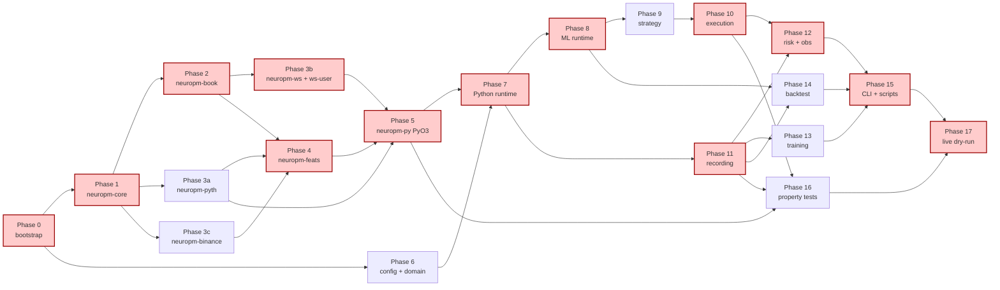

# NEUROPM — Implementation Plan

> Дерево задач, выведенное из `design.md` (§N) и `requirements.md` (Req K).
> Чекбоксы — атомарные deliverables 1–4 ч работы каждая. Каждая задача трассируется к design §, requirement AC, properties P1..P12 и legacy bug fixes L1..L8.
> После завершения всех Phase 0..17 (исключая deferred Phase 2) система готова к live dry-run на SOL.
> Workspace root: `d:\AFF\NEUROPM\`. Все относительные пути — от него.

---

## Phase 0 — Repo bootstrap & tooling

- [x] 0.1 Создать workspace skeleton — `d:\AFF\NEUROPM\`
  - **Goal:** базовое дерево директорий + инициализация git.
  - **Inputs:** Design §4 (module structure).
  - **Deliverables:** директории `rust\`, `python\neuropm\`, `python\tests\`, `data\recorded\`, `data\model_registry\`, `data\results\`, `data\logs\`, `scripts\`, `.kiro\specs\neuropm\` (уже есть). `git init` в корне.
  - **Acceptance:** Req 16 AC 4 (dev_setup приземляется на чистое дерево), Req 16 AC 9 (NTFS-friendly paths).
  - **Refs:** Design §4, §19.1; Reqs 16.4, 16.9.
  - **Depends on:** —

- [x] 0.2 Cargo workspace — `Cargo.toml`, `rust-toolchain.toml`
  - **Goal:** Rust-сторона workspace с pinned toolchain stable 1.79+ и заявленными 7 crates как `members`.
  - **Inputs:** Design §11.1.
  - **Deliverables:** `Cargo.toml` (workspace root, `resolver = "2"`, `[workspace.dependencies]` с tokio/tracing/thiserror/anyhow/smallvec/parking_lot/ahash/serde/simd-json/tungstenite/tokio-tungstenite/reqwest/reqwest-eventsource/ndarray/wide/zstd/arrow/pyo3/numpy), `rust-toolchain.toml` (`channel = "stable"`, `components = ["rustfmt","clippy"]`).
  - **Acceptance:** Req 16 AC 2 (toolchain pin); `cargo --version` показывает 1.79+; `cargo metadata` парсит workspace.
  - **Refs:** Design §11.1; Reqs 16.2.
  - **Depends on:** 0.1

- [x] 0.3 Python build — `pyproject.toml`, `python\neuropm\__init__.py`
  - **Goal:** Python build конфиг через hatchling + maturin backend, target `abi3-py311`.
  - **Inputs:** Design §11.1, §11.9.
  - **Deliverables:** `pyproject.toml` с `[build-system] requires = ["maturin>=1.5"]`, `[tool.maturin] python-source = "python"`, `manifest-path = "rust/neuropm-py/Cargo.toml"`, `module-name = "neuropm._native.neuropm_rs"`. Файл `python\neuropm\__init__.py` экспонирует `__version__`. Папка `python\neuropm\_native\` с пустым `__init__.py`.
  - **Acceptance:** Req 16 AC 3 (pyproject + maturin + abi3-py311).
  - **Refs:** Design §11.9, §19.1; Reqs 16.3.
  - **Depends on:** 0.1

- [x] 0.4 `.gitignore` + `.env.example` + `README.md`
  - **Goal:** baseline repo hygiene.
  - **Inputs:** Design §19.1, Req 13.
  - **Deliverables:**
    - `.gitignore` исключает `target\`, `data\recorded\`, `data\logs\`, `data\model_registry\`, `__pycache__\`, `*.pyc`, `.venv\`, `.env`, `python\neuropm\_native\*.pyd`, `python\neuropm\_native\*.so`.
    - `.env.example` со всеми переменными: `PRIVATE_KEY`, `PROXY_WALLET`, `TG_TOKEN`, `TG_CHAT_ID`, `POLYGON_RPC_URL`, `DRY_RUN=true`. Реальных значений нет.
    - `README.md` с onboarding (setup, run modes, ссылки на design.md/requirements.md/tasks.md).
  - **Acceptance:** Req 13 AC 3, Req 13 AC 4.
  - **Refs:** Design §4, §19.1; Reqs 13.3, 13.4.
  - **Depends on:** 0.1

- [x] 0.5 PowerShell scripts skeletons — `scripts\*.ps1`
  - **Goal:** заготовки run-скриптов; каждая просто echo + exit-1 пока, реализация — Phase 15.
  - **Inputs:** Design §19.13.
  - **Deliverables:** `scripts\dev_setup.ps1`, `scripts\run_live.ps1`, `scripts\run_record_only.ps1`, `scripts\run_backtest.ps1`, `scripts\train.ps1` — каждый с заголовочным комментарием (что должен делать) и `Write-Host "TODO: implement"; exit 1`.
  - **Acceptance:** Req 16 AC 4–7 (skeletons присутствуют).
  - **Refs:** Design §19.13; Reqs 16.4, 16.5, 16.6, 16.7.
  - **Depends on:** 0.1

- [x] 0.6 Pre-commit + linters — `.pre-commit-config.yaml`, `pyproject.toml [tool.ruff]`, `rustfmt.toml`
  - **Goal:** один раз — нормальная гигиена; ruff (lint+format), mypy strict, rustfmt, clippy `-D warnings`.
  - **Deliverables:** `.pre-commit-config.yaml`, `rustfmt.toml` (edition 2021, max_width 110), `[tool.ruff]` + `[tool.mypy]` секции в pyproject.
  - **Acceptance:** `pre-commit run --all-files` проходит на пустом репо. `cargo clippy --all-targets -- -D warnings` зелёный.
  - **Refs:** Design §19.1; Reqs 16.4.
  - **Depends on:** 0.2, 0.3, 0.4

- [x] 0.7 CI placeholder — `.github\workflows\ci.yml` (опционально, если репо на GitHub)
  - **Goal:** один workflow, который на каждый push прогоняет `cargo build`, `cargo clippy`, `pytest`. Если репо локальный — пропустить, но оставить как TODO.
  - **Acceptance:** workflow зелёный на пустом скелете.
  - **Refs:** Design §19.1.
  - **Depends on:** 0.6

---

## Phase 1 — Rust core foundation (`neuropm-core`)

- [x] 1.1 Crate `neuropm-core` skeleton — `rust\neuropm-core\Cargo.toml`, `src\lib.rs`, `src\error.rs`
  - **Goal:** crate инициализирован с deps `serde`, `smallvec`, `thiserror`, `ahash`. `lib.rs` re-exports.
  - **Deliverables:** `rust\neuropm-core\Cargo.toml`, `src\lib.rs` (pub mod асset/money/tick/feature_vec/error), `src\error.rs` (`NeuropmError` enum: Disconnect, ParseFail, BookOutOfOrder, FeatureNan, OracleStale, Crossed, ResyncRequired, ConfigInvalid).
  - **Acceptance:** `cargo build -p neuropm-core` зелёный.
  - **Refs:** Design §11.2; Reqs (foundation; нет прямого AC).
  - **Depends on:** 0.2

- [x] 1.2 `Asset` enum + `AssetSpec` — `rust\neuropm-core\src\asset.rs`
  - **Goal:** типизированный `Asset { Sol, Btc, Eth, Hype }` + `AssetSpec` со всеми полями из design §8.1.
  - **Deliverables:** `asset.rs` с `#[derive(Copy, Clone, Eq, PartialEq, Hash, Debug, Serialize, Deserialize)]` `Asset`, `AssetSpec { asset, pyth_price_id: [u8;32], binance_symbol: SmallString, pm_market_slugs: Vec<SmallString>, durations_min: SmallVec<[u16;4]>, feature_spec_version: u16 }`. Trait `AsAssetTag` с методом `tag_str()` для логов.
  - **Acceptance:** Req 7 AC 1; serde round-trip test зелёный (`Asset::Sol -> "SOL" -> Asset::Sol`).
  - **Refs:** Design §8.1; Reqs 7.1.
  - **Depends on:** 1.1

- [x] 1.3 Money primitives — `rust\neuropm-core\src\money.rs`
  - **Goal:** newtypes `Price(u32 /* ticks of 0.0001 */)`, `Size(u64 /* shares × 10⁴ */)`, `Usd(i64 /* 6 decimals */)` с операциями + checked arithmetic. Цель — компилятор ловит f64 mixups.
  - **Deliverables:** `money.rs` с newtype определениями, `From<f32>`/`as_f32()` конвертерами с явной валидацией диапазонов (`0..=10_000` для Price), `Add/Sub` impls.
  - **Acceptance:** unit-test: `Price::from_f32(0.55).as_f32() == 0.55`; out-of-range f32 → `Err`.
  - **Refs:** Design §11.2.
  - **Depends on:** 1.1

- [x] 1.4 Тики — `rust\neuropm-core\src\tick.rs`
  - **Goal:** `PriceTick { asset, ts_recv_ns, ts_oracle_ms, price: f64, conf_pct: f32 }` + `OrderBookLevel { price: Price, size: Size }` + `OrderBookSnapshot { token_id: [u8;32], asset, ts_recv_ns, seq_no: u64, bids/asks: SmallVec<[Level;32]> }` все `#[repr(C)]`.
  - **Deliverables:** `tick.rs`. Конст `MAX_LEVELS = 32`.
  - **Acceptance:** `std::mem::size_of::<OrderBookSnapshot>()` стабилен между билдами; нет paddings unaligned.
  - **Refs:** Design §11.2.
  - **Depends on:** 1.2, 1.3

- [x] 1.5 `FeatureVector` slab — `rust\neuropm-core\src\feature_vec.rs`
  - **Goal:** `#[repr(C)] FeatureVector { asset, ts_ns, schema_version, values: [f32; 80] }` + `validate_finite()` метод возвращающий `Result<(), NeuropmError::FeatureNan>`.
  - **Deliverables:** `feature_vec.rs`. Конст `FEATURE_DIM = 80`.
  - **Acceptance:** Req 4 AC 7 (ровно 80 слотов); test: `validate_finite()` ловит NaN/Inf и возвращает Err.
  - **Refs:** Design §11.2, §15.1; Reqs 4.5, 4.7.
  - **Depends on:** 1.2

---

## Phase 2 — Storage primitives (`neuropm-book`)

- [x] 2.1 Crate `neuropm-book` skeleton — `rust\neuropm-book\Cargo.toml`, `src\lib.rs`
  - **Deliverables:** Cargo.toml (deps: `neuropm-core`, `smallvec`, `parking_lot`, `arc-swap`, `tracing`).
  - **Acceptance:** `cargo build -p neuropm-book` зелёный.
  - **Refs:** Design §11.8.
  - **Depends on:** 1.4

- [x] 2.2 `OrderBook` struct + `apply_book_event` — `rust\neuropm-book\src\book.rs`
  - **Goal:** реализация апдейт-алгоритма из design §13.2. PM CLOB шлёт `book` (snapshot), `price_change` (incremental), `best_bid_ask` (throttled).
  - **Deliverables:** `book.rs` с `OrderBook { token_id, asset, bids, asks, seq_no, last_apply_ts, state: BookState }`. Метод `apply(ev) -> Result<(), NeuropmError::ResyncRequired>`. Defensive sort на каждом snapshot apply (Req 3.9). Idempotency на duplicate seq_no. Crossed-book detection (assert + transition state on second consecutive crossed).
  - **Acceptance:** Req 3 AC 2, 3 AC 3, 3 AC 4 (return ResyncRequired on gap), 3 AC 5 (size=0 = remove), 3 AC 6 (no-crossed invariant), 3 AC 9 (parse_levels всегда сортирует).
  - **Refs:** Design §13.2, §13.3; Reqs 3.2–3.9; Properties P10, P11; Legacy fix L5.
  - **Depends on:** 2.1

- [x] 2.3 `is_ready` predicate — `rust\neuropm-book\src\book.rs`
  - **Goal:** `is_ready()` = `(now_ns() - last_apply_ts) < 5_000_000_000 && seq_no > 0 && state != Crossed && state != NotReady`.
  - **Deliverables:** метод на `OrderBook`.
  - **Acceptance:** Req 3 AC 8 (gating inference на `is_ready`).
  - **Refs:** Design §10.2, §13.3; Reqs 3.8.
  - **Depends on:** 2.2

- [x] 2.4 Replay harness — `rust\neuropm-book\src\replay.rs`
  - **Goal:** функция `replay(events: &[BookEvent]) -> OrderBook` для property tests.
  - **Deliverables:** `replay.rs`.
  - **Acceptance:** `cargo test -p neuropm-book` (smoke replay зелёный).
  - **Refs:** Design §11.8 (replay для tests).
  - **Depends on:** 2.2

- [x] 2.5 `arc_swap` lock-free read view — `rust\neuropm-book\src\lib.rs`
  - **Goal:** `BookHandle` оборачивает `arc_swap::ArcSwap<OrderBookSnapshot>` для lock-free чтения из feature engine + Python.
  - **Deliverables:** `BookHandle::load() -> Arc<OrderBookSnapshot>`, `BookHandle::store(snapshot)`. Только writer task мутирует через `store`.
  - **Acceptance:** Req 14 AC 4 (per-token serialization through arc_swap).
  - **Refs:** Design §18.2; Reqs 14.4.
  - **Depends on:** 2.2

---

## Phase 3 — External feeds (Pyth, PM market WS, PM user WS, Binance)

- [x] 3.1 Crate `neuropm-pyth` skeleton — `rust\neuropm-pyth\Cargo.toml`, `src\lib.rs`
  - **Deliverables:** Cargo.toml (deps: `tokio`, `reqwest` features=["stream"], `reqwest-eventsource`, `neuropm-core`, `tracing`, `base64`). Module structure: `lib.rs`, `sse.rs`, `vaa.rs`.
  - **Acceptance:** `cargo build -p neuropm-pyth` зелёный.
  - **Refs:** Design §11.6; Reqs 2.1.
  - **Depends on:** 1.4

- [x] 3.2 SSE client — `rust\neuropm-pyth\src\sse.rs`
  - **Goal:** Подписка на `https://hermes.pyth.network/v2/updates/price/stream?ids[]=...&parsed=false&binary=true`. Стрим chunks, retry с exponential backoff (1, 2, 4, ..., 30s cap).
  - **Deliverables:** `HermesSseClient::start(price_ids: Vec<[u8;32]>) -> mpsc::Receiver<RawVaaChunk>`.
  - **Acceptance:** Req 2 AC 1 (SSE только), Req 2 AC 8 (reconnect + backoff). Smoke test: подключение к реальному Hermes, получение хотя бы 5 chunks за 10s.
  - **Refs:** Design §11.6; Reqs 2.1, 2.8; Legacy fix L2.
  - **Depends on:** 3.1

- [x] 3.3 VAA decoder — `rust\neuropm-pyth\src\vaa.rs`
  - **Goal:** Decode binary base64 VAA → `PriceTick`. Свой decoder ~200 LOC, не тянем `pyth-sdk-rs` (transitive deps жирные).
  - **Deliverables:** `decode_vaa(b64: &str) -> Result<PriceTick, NeuropmError::ParseFail>`. Парсинг ts_oracle_ms, price (i64×10^expo), conf.
  - **Acceptance:** Req 2 AC 3 (p99 ≤ 150 µs); micro-benchmark на 1000 VAA chunks: `criterion::bench` показывает <150 µs p99.
  - **Refs:** Design §11.6, §3.2 (S1 budget); Reqs 2.3, 8.2.
  - **Depends on:** 3.2

- [x] 3.4 Pyth ring buffer + `PythStream` Rust API — `rust\neuropm-pyth\src\lib.rs`
  - **Goal:** `PythStream::start()` запускает задачу, держит per-asset ring buffer 4096 ticks, broadcast subscribers через `tokio::sync::broadcast`. `latest(asset) -> Option<PriceTick>` lock-free.
  - **Deliverables:** `lib.rs` с `PythStream` API.
  - **Acceptance:** Req 2 AC 1 (streaming); test: начать stream, подождать 1s, `latest(Sol).is_some()`.
  - **Refs:** Design §11.6; Reqs 2.1.
  - **Depends on:** 3.3

- [x] 3.5 Crate `neuropm-ws` skeleton — `rust\neuropm-ws\Cargo.toml`, `src\lib.rs`
  - **Deliverables:** Cargo.toml (deps: `tokio`, `tokio-tungstenite` features=["native-tls"], `simd-json`, `serde`, `neuropm-core`, `neuropm-book`, `tracing`).
  - **Acceptance:** `cargo build -p neuropm-ws` зелёный.
  - **Refs:** Design §11.4; Reqs 3.1.
  - **Depends on:** 2.5

- [x] 3.6 PM market WS client — `rust\neuropm-ws\src\client.rs`
  - **Goal:** Connect to `wss://ws-subscriptions-clob.polymarket.com/ws/market`. Subscribe to token_ids. Parse incoming msgs via `simd-json::from_slice`. Dispatch к per-token book apply task.
  - **Deliverables:** `MarketWsClient` с `subscribe(token_ids)`, `unsubscribe(token_ids)`. Channel `mpsc::channel(8192)` от WS task до book apply task.
  - **Acceptance:** Req 3 AC 1 (WS only, no REST в hot-path). Smoke: подключиться, подписаться на active SOL token_id, получить minimum 1 `book` event + несколько `price_change`.
  - **Refs:** Design §11.4; Reqs 3.1.
  - **Depends on:** 3.5

- [x] 3.7 REST snapshot fallback — `rust\neuropm-ws\src\rest.rs`
  - **Goal:** `fetch_book_snapshot(token_id) -> OrderBookSnapshot` для resync (used after disconnect or seq gap).
  - **Deliverables:** `rest.rs` с `reqwest::Client` к `clob.polymarket.com/book?token_id=...`.
  - **Acceptance:** Req 3 AC 4 (resync с REST snapshot); Req 9 AC 1 (reconnect path).
  - **Refs:** Design §13.4; Reqs 3.4, 9.1.
  - **Depends on:** 3.6

- [x] 3.8 Resync orchestration — `rust\neuropm-ws\src\resync.rs`
  - **Goal:** Detect seq gap (по сигналу из book apply task через `ResyncRequired`), pause inference (set book state NotReady), fetch REST snapshot, drain WS replay buffer, re-arm.
  - **Deliverables:** `resync.rs` + интеграция с `MarketWsClient`. Replay buffer = `VecDeque<BookEvent>` с capacity 256.
  - **Acceptance:** Req 3 AC 4, Req 9 AC 1, Req 9 AC 10 (gating до `is_ready`); property test (Phase 16) проверяет.
  - **Refs:** Design §13.4, §10.2; Reqs 3.4, 9.1, 9.10.
  - **Depends on:** 3.7

- [x] 3.9 Crate `neuropm-ws-user` — `rust\neuropm-ws-user\`
  - **Goal:** PM user WS client с EIP-712 auth handshake. Получает `order_placed`, `order_matched`, `order_cancelled`, `trade_settled`. Heartbeat tracking (3 missed = reconnect).
  - **Deliverables:** Cargo.toml + `src\lib.rs` с `UserWsClient::start(api_creds, on_event)`.
  - **Acceptance:** Req 9 AC 3 (heartbeat → reconnect → REST fallback).
  - **Refs:** Design §11.5; Reqs 9.3.
  - **Depends on:** 3.5

- [x] 3.10 Crate `neuropm-binance` — `rust\neuropm-binance\`
  - **Goal:** Binance Futures WS client для микроструктуры. Streams: `bookTicker`, `depth20@100ms`, `aggTrade`, `markPrice@1s` per symbol. **Не используется как oracle.**
  - **Deliverables:** Cargo.toml + `src\lib.rs` с `BinanceWsClient::start(symbols)`. Per-symbol ring buffer + broadcast.
  - **Acceptance:** Smoke test: подключение к `fstream.binance.com`, получение событий из всех 4 stream'ов.
  - **Refs:** Design §11.7; Reqs 9.4 (degradation when stale).
  - **Depends on:** 3.5

---

## Phase 4 — Feature engine (`neuropm-feats`)

- [x] 4.1 Crate `neuropm-feats` skeleton — `rust\neuropm-feats\`
  - **Deliverables:** Cargo.toml (deps: `neuropm-core`, `neuropm-book`, `ndarray`, `wide`, `smallvec`, `tracing`). Module: `lib.rs`, `shares.rs`, `micro.rs`, `oracle.rs`, `assemble.rs`.
  - **Acceptance:** `cargo build -p neuropm-feats` зелёный.
  - **Refs:** Design §11.3.
  - **Depends on:** 2.5, 3.4, 3.10

- [x] 4.2 Shares features (16 шт) — `rust\neuropm-feats\src\shares.rs`
  - **Goal:** все 16 shares-фич из design §15.1: time_remaining_pct, time_remaining_min, time_elapsed_min, life_phase, distance_from_ptb_pct/norm, up_implied_prob_via_ask, up_implied_prob_via_bid, mispricing_score, shares_momentum_30s/1m/3m, vol_imbalance, liquidity_score, spread_normalized, mean_reversion_strength, arbitrage_residual.
  - **Deliverables:** `shares.rs` с `compute_shares_features(book_yes, book_no, ptb, oracle_price, ts) -> [f32; 16]`. Zero-allocation: scratch buffers pre-allocated в struct.
  - **Acceptance:** Req 4 AC 7 (16 shares features); unit tests: все фичи finite на типичных вводах; edge cases (empty bids/asks → 0.0 не NaN).
  - **Refs:** Design §15.1, §11.3; Reqs 4.7.
  - **Depends on:** 4.1

- [x] 4.3 Microstructure features (36 шт) — `rust\neuropm-feats\src\micro.rs`
  - **Goal:** 36 микроструктурных фич из design §15.1: best_bid/ask, mid, micro_price, spread_bps, depth_top1/top5_imbalance, OFI_1s/5s/10s, trade_imbalance_1s/5s/10s, vwap_buy/sell_1s/5s, taker_buy_ratio, large_trade_count, funding_rate, mark_basis_pct, oi_change, depth_replenishment, hidden_liquidity_proxy, kyle_lambda, amihud_illiq, realized_vol_30s/1m/5m, return_30s/1m/3m/5m, и т.д.
  - **Deliverables:** `micro.rs` с `compute_micro_features(binance_book, trade_tape, mark_price_ring) -> [f32; 36]`. SIMD через `wide::f32x8` для агрегаций.
  - **Acceptance:** Req 4 AC 7 (36 micro features). Unit tests на каждую агрегатную фичу.
  - **Refs:** Design §15.1; Reqs 4.7.
  - **Depends on:** 4.1

- [x] 4.4 Oracle-derived features (12 шт) — `rust\neuropm-feats\src\oracle.rs`
  - **Goal:** 12 oracle-derived фич: pyth_last_price, pyth_conf_pct, pyth_distance_from_ptb_pct, pyth_velocity_500ms/2s/10s, pyth_accel_2s, pyth_oracle_skew_vs_binance_bps, pyth_minutes_since_last_publish, pyth_inter_publish_jitter, pyth_dir_streak_signed, pyth_zscore_30s, pyth_extreme_flag.
  - **Deliverables:** `oracle.rs` с `compute_oracle_features(pyth_ring, binance_mark_ring, ptb) -> [f32; 12]`.
  - **Acceptance:** Req 4 AC 7 (12 oracle features).
  - **Refs:** Design §15.1; Reqs 4.7.
  - **Depends on:** 4.1

- [x] 4.5 Time / context features (8 шт) — `rust\neuropm-feats\src\time_ctx.rs`
  - **Goal:** 8 контекстных: epoch_minutes_since_open, weekend_flag, hour_utc, hour_utc_sin/cos, day_of_week_sin/cos, market_duration_min.
  - **Deliverables:** `time_ctx.rs`.
  - **Acceptance:** Req 4 AC 7.
  - **Refs:** Design §15.1; Reqs 4.7.
  - **Depends on:** 4.1

- [x] 4.6 Assemble + finiteness validation — `rust\neuropm-feats\src\assemble.rs`
  - **Goal:** Соединить 16+36+12+8 = 72 фич + 8 padding в `[f32; 80]`. Валидировать finiteness (`validate_finite()` из 1.5). При NaN/Inf → return `Err(NeuropmError::FeatureNan)`.
  - **Deliverables:** `assemble.rs` с `FeatureEngine::emit() -> Result<FeatureVector, NeuropmError::FeatureNan>`.
  - **Acceptance:** Req 4 AC 5 (skip on non-finite), Req 4 AC 6 (no future leakage), Req 4 AC 7 (80 slots, 72 named + 8 padding), Req 4 AC 8 (feature_spec_version mismatch fails fast).
  - **Refs:** Design §15.1, §11.3; Reqs 4.5, 4.6, 4.7, 4.8; Property P4.
  - **Depends on:** 4.2, 4.3, 4.4, 4.5

- [x] 4.7 Feature ring (последние 60 vectors) — `rust\neuropm-feats\src\ring.rs`
  - **Goal:** ring buffer last 60 `FeatureVector`s для transformer sequence input.
  - **Deliverables:** `ring.rs` с `FeatureRing { capacity: 60, data: VecDeque<Arc<FeatureVector>> }`. `latest()`, `sequence(n)`.
  - **Acceptance:** unit-test: push 60 → последний `latest()` равен последнему пушу; `sequence(60)` возвращает все 60 в порядке.
  - **Refs:** Design §6.2 (FeatureRing), §15.2 (transformer input).
  - **Depends on:** 4.6

- [x] 4.8 SIMD benchmark — `rust\neuropm-feats\benches\bench_assemble.rs`
  - **Goal:** `criterion`-бенч `bench_assemble` показывает p99 ≤ 200 µs на полную сборку 80-мерного вектора.
  - **Deliverables:** `benches\bench_assemble.rs`, добавить `[[bench]]` в Cargo.toml.
  - **Acceptance:** Req 8 AC 5 (feature assembly p99 ≤ 200 µs); CI запускает `cargo bench -p neuropm-feats` и проверяет регрессию.
  - **Refs:** Design §3.2 (S4), §9; Reqs 8.5; Legacy fix L4.
  - **Depends on:** 4.6

---

## Phase 5 — PyO3 boundary (`neuropm-py`)

- [~] 5.1 Crate `neuropm-py` skeleton — `rust\neuropm-py\`
  - **Deliverables:** Cargo.toml (deps: `pyo3` features=["extension-module","abi3-py311"], `numpy`, все остальные `neuropm-*` crates). `[lib] crate-type=["cdylib"]`. `src\lib.rs` с `#[pymodule] fn neuropm_rs(...)`.
  - **Acceptance:** `maturin develop` собирает `python\neuropm\_native\neuropm_rs.pyd`. `python -c "from neuropm._native import neuropm_rs"` импортируется без ошибок.
  - **Refs:** Design §11.9, §12.
  - **Depends on:** 0.3, 4.7

- [~] 5.2 `PMMarketWs` PyO3 class — `rust\neuropm-py\src\pm_ws.rs`
  - **Goal:** Wrapper над `MarketWsClient`. `__new__(asset_specs, on_book_event)`, `subscribe(token_ids)`, `best_bid_ask(token_id) -> Option<(f32,f32)>`, `snapshot(token_id) -> dict`, `close()`.
  - **Deliverables:** `pm_ws.rs`. Callback `on_book_event` хранится как `PyObject`, вызывается через `Python::with_gil` минимально (только сам `call`).
  - **Acceptance:** Python-side smoke: создание класса, подписка, callback вызывается.
  - **Refs:** Design §12.2, §12.3.
  - **Depends on:** 5.1, 3.6

- [~] 5.3 `PythStream` PyO3 class — `rust\neuropm-py\src\pyth.rs`
  - **Goal:** Wrapper над `neuropm-pyth::PythStream`. Те же паттерны что в 5.2.
  - **Deliverables:** `pyth.rs`.
  - **Acceptance:** Python smoke.
  - **Refs:** Design §12.2.
  - **Depends on:** 5.1, 3.4

- [~] 5.4 `OrderBookHandle` PyO3 class — `rust\neuropm-py\src\book.rs`
  - **Goal:** Read-only Python view на `BookHandle::load()`. Методы `best_bid(token_id)`, `best_ask(token_id)`, `is_ready(token_id)`, `levels(token_id, depth=5)` -> dict.
  - **Deliverables:** `book.rs`.
  - **Acceptance:** Python smoke.
  - **Refs:** Design §12.2.
  - **Depends on:** 5.1, 2.5

- [~] 5.5 `FeatureEngine` PyO3 class + zero-copy NumPy view — `rust\neuropm-py\src\feats.rs`
  - **Goal:** **Самая чувствительная FFI часть.** `latest_view(py) -> &PyArray1<f32>` отдаёт zero-copy NumPy view на `Arc<FeatureVector>::values`. `sequence_view(py, n) -> &PyArray2<f32>` — view на ring buffer (формирует contiguous slice).
  - **Deliverables:** `feats.rs`. Использовать `numpy::PyArray1::from_slice` для zero-copy.
  - **Acceptance:** Req 4 AC 7 (80 features), Req 8 AC 6 (PyO3 cross p99 ≤ 50 µs); micro-bench `python -m pytest python\tests\unit\test_ffi_zero_copy.py` (новый) проверяет что `arr.flags['OWNDATA']==False` и время вызова <50 µs p99.
  - **Refs:** Design §12.1, §12.2; Reqs 4.7, 8.6.
  - **Depends on:** 5.1, 4.7

- [~] 5.6 PyO3 module registration — `rust\neuropm-py\src\lib.rs`
  - **Goal:** `#[pymodule] fn neuropm_rs(_py: Python, m: &PyModule)` регистрирует все 4 класса.
  - **Deliverables:** `lib.rs` complete.
  - **Acceptance:** `from neuropm._native.neuropm_rs import PMMarketWs, PythStream, OrderBookHandle, FeatureEngine` работает.
  - **Refs:** Design §12.
  - **Depends on:** 5.2, 5.3, 5.4, 5.5

- [~] 5.7 Python `.pyi` stubs — `python\neuropm\_native\__init__.pyi`
  - **Goal:** Type stubs для всех 4 PyO3 классов (см. design §12.2).
  - **Deliverables:** `__init__.pyi` с полными class signatures.
  - **Acceptance:** `mypy python\neuropm\` зелёный.
  - **Refs:** Design §12.2.
  - **Depends on:** 5.6

---

## Phase 6 — Python config + domain

- [~] 6.1 Config TOML files — `python\neuropm\config\*.toml`
  - **Goal:** Создать `settings.toml`, `trading.toml`, `assets\sol.toml`, `assets\btc.toml` (disabled), `assets\eth.toml` (disabled), `assets\hype.toml` (disabled). Содержимое строго из design §7.3.
  - **Deliverables:** 6 TOML файлов с полными схемами.
  - **Acceptance:** Req 11 AC 1 (TOML only); содержимое матчит design §7.3 byte-for-byte.
  - **Refs:** Design §7.3; Reqs 11.1.
  - **Depends on:** 0.3

- [~] 6.2 Config loader + pydantic v2 модели — `python\neuropm\config\loader.py`
  - **Goal:** `load(env="prod"|"dev") -> AppConfig`. Merge order `settings → trading → asset → env-overrides`. `pydantic` v2 валидация, fail-fast на unknown keys.
  - **Deliverables:** `loader.py`, модели `Settings`, `TradingConfig`, `AssetConfig`, `RiskConfig`, `AppConfig`.
  - **Acceptance:** Req 11 AC 2, 11 AC 3, 11 AC 7 (no enabled asset → fail), 11 AC 8 (dry-run validates same).
  - **Refs:** Design §7.2, §7.4; Reqs 11.2, 11.3, 11.7, 11.8.
  - **Depends on:** 6.1

- [~] 6.3 Config validators — `python\neuropm\config\validators.py`
  - **Goal:** Валидаторы для: pyth_price_id (32 bytes hex), `min_share_price < max_share_price`, `min_entry_pct < max_entry_pct`, `gap_min_pct ≥ 0`, `streak_required ≥ 1`, `streak_interval_s > 0`, `enabled=true → model registry path exists`.
  - **Deliverables:** `validators.py` с `pydantic.model_validator` функциями.
  - **Acceptance:** Req 11 AC 4, 11 AC 5, 11 AC 6.
  - **Refs:** Design §7.4; Reqs 11.4, 11.5, 11.6.
  - **Depends on:** 6.2

- [~] 6.4 Domain `AssetSpec` Python mirror — `python\neuropm\domain\asset.py`
  - **Goal:** Pydantic `AssetSpec` mirror Rust struct field-for-field.
  - **Deliverables:** `asset.py`.
  - **Acceptance:** Req 7 AC 2 (mirror); cross-validation: serialize Python `AssetSpec` → JSON → deserialize в Rust → bit-equal.
  - **Refs:** Design §8.2; Reqs 7.2.
  - **Depends on:** 6.3

- [~] 6.5 Pricing — `python\neuropm\domain\pricing.py`
  - **Goal:** Чистые функции `effective_entry_price(direction, ask_levels, order_size_usd)`, `effective_exit_price(direction, bid_levels, shares_to_sell)`, `mark_to_market(position, book)` строго по design §14.2/§14.3.
  - **Deliverables:** `pricing.py` с тремя функциями + `PositionMarks` dataclass из design §14.6.
  - **Acceptance:** Req 1 AC 1, 1 AC 2, 1 AC 4, 1 AC 5, 1 AC 8 (monotone in size), 1 AC 9 (max fill price ≤ max + slip).
  - **Refs:** Design §14.2, §14.3, §14.6; Reqs 1.1, 1.2, 1.4, 1.5, 1.8, 1.9; Properties P1, P2, P9; Legacy fix L1.
  - **Depends on:** 6.4

- [~] 6.6 PnL — `python\neuropm\domain\pnl.py`
  - **Goal:** `realized_pnl()`, `mtm_pnl()`, `at_resolution_pnl()` + комбинированный `total_pnl(position, exit_event)` для случаев partial-fill auto-takeprofit (design §14.4).
  - **Deliverables:** `pnl.py`.
  - **Acceptance:** Req 1 AC 6, 1 AC 7.
  - **Refs:** Design §14.4; Reqs 1.6, 1.7.
  - **Depends on:** 6.5

- [~] 6.7 Market snapshot + neg_risk symmetry — `python\neuropm\domain\market.py`
  - **Goal:** `MarketSnapshot` dataclass со всеми полями (slug, condition_id, yes_token_id, no_token_id, ptb, end_date, neg_risk, и т.д.). `_resolve_neg_risk(market_meta)`. Helpers для arbitrage residual.
  - **Deliverables:** `market.py`.
  - **Acceptance:** Req 1 AC 10 (arbitrage residual), Req 5 AC 10 (neg_risk не hardcoded).
  - **Refs:** Design §14.5; Reqs 1.10, 5.10; Property P12.
  - **Depends on:** 6.6

---

## Phase 7 — Python runtime skeleton

- [~] 7.1 Logger — `python\neuropm\utils\logger.py`
  - **Goal:** `loguru` с rotation 64 MB, retention 30d, JSON-структурированные records, redaction PRIVATE_KEY и 64+ hex substrings.
  - **Deliverables:** `logger.py`.
  - **Acceptance:** Req 12 AC 4, 12 AC 5, Req 13 AC 5.
  - **Refs:** Design §1 goal 7; Reqs 12.4, 12.5, 13.5.
  - **Depends on:** 6.2

- [~] 7.2 Clock + drift monitor — `python\neuropm\runtime\clock.py`
  - **Goal:** `monotonic_ns()`, `utc_now_ms()` helpers. Drift monitor task: warning если |monotonic - wall| > 50 ms за 10s sample.
  - **Deliverables:** `clock.py`.
  - **Acceptance:** Req 14 AC 6 (drift monitor).
  - **Refs:** Design §5.2; Reqs 14.6.
  - **Depends on:** 7.1

- [~] 7.3 WS supervisor — `python\neuropm\runtime\ws_supervisor.py`
  - **Goal:** Координирует все WS задачи (PM market, PM user, Pyth, Binance). Reconnect orchestration. Health states (Healthy/Degraded/Dead) per источник.
  - **Deliverables:** `ws_supervisor.py`. Использует Rust клиенты через PyO3.
  - **Acceptance:** Req 9 AC 1–4 (failure handling per source).
  - **Refs:** Design §10, §10.2; Reqs 9.1, 9.2, 9.3, 9.4.
  - **Depends on:** 5.6, 7.2

- [~] 7.4 Tick pump — `python\neuropm\runtime\tick_pump.py`
  - **Goal:** Event-driven debounced trigger. `on_book_event(token_id)` → schedule predict с 200ms debounce. Heartbeat tick раз в 1s если pending=False.
  - **Deliverables:** `tick_pump.py`.
  - **Acceptance:** Req 4 AC 3 (200 ms cadence), 4 AC 4 (heartbeat при отсутствии events).
  - **Refs:** Design §15.3; Reqs 4.3, 4.4.
  - **Depends on:** 7.3

- [~] 7.5 State registry — `python\neuropm\runtime\state.py`
  - **Goal:** Atomic `StateSnapshot` для dashboard. Per-asset best_bid/ask, last prediction, open positions, presigned status, latency histograms, recorder drop counters. Update от всех producer задач.
  - **Deliverables:** `state.py` со `StateRegistry` singleton.
  - **Acceptance:** Req 12 AC 2 (StateSnapshot served via /api/state).
  - **Refs:** Design §3.3 (cold-path), §17.2; Reqs 12.2.
  - **Depends on:** 7.4

- [~] 7.6 Orchestrator — `python\neuropm\runtime\orchestrator.py`
  - **Goal:** Main asyncio loop. Wires: WsSupervisor → TickPump → InferenceTask → StrategyTask → Executor → Recorder → Dashboard → TelegramBot. Graceful shutdown ordering (Req 14 AC 5).
  - **Deliverables:** `orchestrator.py` с `async def run()`.
  - **Acceptance:** Req 14 AC 1 (single asyncio + tokio + threadpool), 14 AC 2 (no multiprocessing), 14 AC 5 (shutdown ordering: producers → executor → recorder).
  - **Refs:** Design §5.1, §5.2, §18.1; Reqs 14.1, 14.2, 14.5; Legacy fix L6.
  - **Depends on:** 7.5

---

## Phase 8 — ML runtime

- [~] 8.1 Model registry — `python\neuropm\ml\registry.py`
  - **Goal:** `resolve_path(asset, version="latest") -> Path` к `data\model_registry\{asset}\{ver}\`. Загрузка `meta.json`, `feature_spec.json`, `calibration.json`. Проверка `feature_spec_version` matches Rust.
  - **Deliverables:** `registry.py`.
  - **Acceptance:** Req 4 AC 8 (version mismatch fails fast), Req 7 AC 6 (registry exists for enabled asset).
  - **Refs:** Design §15.2; Reqs 4.8, 7.6.
  - **Depends on:** 6.4

- [~] 8.2 ONNX session manager — `python\neuropm\ml\runtime.py`
  - **Goal:** Загрузка ONNX моделей через `onnxruntime`. Per-asset `ModelBundle { cb, lgbm, xgb, rf, transformer? }`. Warmup ≥50 dummy inferences. Запрет joblib/pickle (типизированный fail-fast).
  - **Deliverables:** `runtime.py` с `ModelBundle.load(path)`, `ModelBundle.warmup(n)`, `predict(view) -> dict`.
  - **Acceptance:** Req 4 AC 1 (ONNX only, no joblib), 4 AC 2 (warmup ≥50).
  - **Refs:** Design §15.2, §15.8; Reqs 4.1, 4.2; Legacy fix L3.
  - **Depends on:** 8.1, 5.5

- [~] 8.3 Calibration — `python\neuropm\ml\calibration.py`
  - **Goal:** `apply_calibration(raw_probs, calibration_json)` — isotonic или Platt per model.
  - **Deliverables:** `calibration.py`.
  - **Acceptance:** Req 4 AC 9 (calibration перед сравнением с min_confidence или ensemble averaging).
  - **Refs:** Design §15.6; Reqs 4.9.
  - **Depends on:** 8.2

- [~] 8.4 Ensemble combiner — `python\neuropm\ml\ensemble.py`
  - **Goal:** Weighted average калибрированных вероятностей. `combine(cal_probs, weights) -> p_up`.
  - **Deliverables:** `ensemble.py`.
  - **Acceptance:** Req 4 AC 9 (ensemble после calibration).
  - **Refs:** Design §15.7; Reqs 4.9.
  - **Depends on:** 8.3

- [~] 8.5 Transformer veto — `python\neuropm\ml\transformer.py`
  - **Goal:** Предсказание transformer'а на sequence_view (60×80). Veto-логика: если sign(p_trans-0.5) ≠ sign(p_ens-0.5) AND |p_trans-0.5|>VETO_MARGIN → veto.
  - **Deliverables:** `transformer.py`.
  - **Acceptance:** Req 4 AC 10 (transformer veto).
  - **Refs:** Design §15.7; Reqs 4.10.
  - **Depends on:** 8.4, 5.5

- [~] 8.6 Inference task — `python\neuropm\ml\inference.py`
  - **Goal:** `inference_loop(asset)`: fv from `FeatureEngine.latest_view()`, валидация finiteness, parallel run ensemble через `asyncio.gather` + `to_thread`, calibration, ensemble combine, optional transformer veto, emit Prediction.
  - **Deliverables:** `inference.py`.
  - **Acceptance:** Req 4 AC 5 (skip on NaN, increment metric), Req 8 AC 7 (ensemble parallel ≈ max(individual)), Req 8 AC 8 (transformer p99 ≤ 1.5 ms), Req 14 AC 7 (ONNX through to_thread).
  - **Refs:** Design §15.9, §3.2; Reqs 4.5, 8.7, 8.8, 14.7.
  - **Depends on:** 8.5

---

## Phase 9 — Strategy

- [~] 9.1 Base protocol — `python\neuropm\strategy\base.py`
  - **Goal:** `StrategyProtocol`: `evaluate(features, market_state) -> Optional[Signal]`, `should_exit(...)`.
  - **Deliverables:** `base.py`.
  - **Acceptance:** type-check.
  - **Refs:** Design §19.7.
  - **Depends on:** 8.6

- [~] 9.2 Streak filter — `python\neuropm\strategy\filters.py::streak_check`
  - **Goal:** Реализация per design §15.4. История последних 16 prediction'ов per asset. Требования: streak_required последних подряд same direction, каждый conf≥min_confidence, max gap ≤ streak_interval_s.
  - **Deliverables:** `filters.py::streak_check`.
  - **Acceptance:** Req 4 AC 11.
  - **Refs:** Design §15.4; Reqs 4.11.
  - **Depends on:** 9.1

- [~] 9.3 Gap-momentum filter — `python\neuropm\strategy\filters.py::gap_momentum_check`
  - **Goal:** `direction_signed_gap_pct = ((sol_price - ptb)/ptb*100) * (+1 if UP else -1)`. Pass ↔ ≥ gap_min_pct.
  - **Deliverables:** `filters.py::gap_momentum_check`.
  - **Acceptance:** Req 4 AC 12.
  - **Refs:** Design §15.5; Reqs 4.12.
  - **Depends on:** 9.2

- [~] 9.4 Price/spread/depth gates — `python\neuropm\strategy\filters.py::market_gates`
  - **Goal:** Gates: `min_share_price ≤ best_ask ≤ max_share_price`, `spread ≤ max_spread`, `ask_depth ≥ min_depth_shares`, `min_entry_pct ≤ market_pct ≤ max_entry_pct`.
  - **Deliverables:** `filters.py::market_gates`.
  - **Acceptance:** Reqs 5.4 (presigner range), 10.1 (max_open_positions), 10.2 (max_inventory).
  - **Refs:** Design §15.4; Reqs 5.4, 10.1, 10.2.
  - **Depends on:** 9.3

- [~] 9.5 Position sizing — `python\neuropm\strategy\sizing.py`
  - **Goal:** Fixed размер из конфига; Kelly fraction опционально (флаг в `trading.toml`).
  - **Deliverables:** `sizing.py`.
  - **Acceptance:** Reqs 10.2.
  - **Refs:** Design §19.7; Reqs 10.2.
  - **Depends on:** 9.4

- [~] 9.6 Ensemble streak strategy — `python\neuropm\strategy\ensemble_streak.py`
  - **Goal:** Реализация POLY-DESTROYER active config: `H_catboost 85% 2x gm0.03 SP$0.40-$0.55`. `evaluate()` соединяет все фильтры из 9.2..9.5.
  - **Deliverables:** `ensemble_streak.py`.
  - **Acceptance:** smoke test на synthetic features триггерит вход когда все gates pass.
  - **Refs:** Design §15.4, §15.5, §1 goal 5; Reqs 4.11, 4.12.
  - **Depends on:** 9.5

---

## Phase 10 — Execution

- [~] 10.1 CLOB client wrapper — `python\neuropm\execution\clob_client.py`
  - **Goal:** Wrapper над py-clob-client v2. API: `init()`, `presign_buy()`, `post_presigned()`, `buy_market()`, `buy_limit()`, `sell_limit_99()`, `sell_market()`, `cancel_order()`, `cancel_all()`, `get_balance()`, `get_share_balance()`, `get_open_orders()`. dry_run flag.
  - **Deliverables:** `clob_client.py`. Перенос логики из POLY-DESTROYER `api/clob_client.py`.
  - **Acceptance:** Req 5 AC 7 (post-fill SELL @ 0.99), Req 5 AC 10 (neg_risk derived).
  - **Refs:** Design §16.3, §14.5; Reqs 5.7, 5.10.
  - **Depends on:** 7.1

- [~] 10.2 Pre-signer — `python\neuropm\execution\presigner.py`
  - **Goal:** `presigner_task(token_id, direction)`. Maintain ≤1 pre-signed per (token, direction). Re-sign triggers: `|best_ask - pinned| ≥ REPRESIGN_TICKS`, `now - created_ts > 30s`, `best_ask` out of `[min, max]_share_price`.
  - **Deliverables:** `presigner.py`.
  - **Acceptance:** Req 5 AC 1, 5 AC 2 (re-sign on move), 5 AC 3 (TTL 30s), 5 AC 4 (no presign out of range).
  - **Refs:** Design §16.2; Reqs 5.1, 5.2, 5.3, 5.4; Property P8.
  - **Depends on:** 10.1

- [~] 10.3 Executor state machine — `python\neuropm\execution\executor.py`
  - **Goal:** State machine из design §16.1: Idle → Presigning → PresignedReady → Posting → Filled → SellArming → Holding → SellHit/Resolved/EmergencyExit. Includes timeout cancellation (10s).
  - **Deliverables:** `executor.py` с явным enum `ExecutorState` и transitions.
  - **Acceptance:** Req 5 AC 5 (post pre-signed within 150ms), 5 AC 6 (presign miss fallback + metric), 5 AC 8 (timeout 10s cancel), 5 AC 9 (graceful shutdown).
  - **Refs:** Design §16.1, §16.5; Reqs 5.5, 5.6, 5.8, 5.9.
  - **Depends on:** 10.2

- [~] 10.4 Auto-redeem — `python\neuropm\execution\auto_redeem.py`
  - **Goal:** Cycle every 120s. Для resolved-positions с outcome=direction: вызвать `CTFExchange.redeemPositions` через web3 + Polygon RPC. Gas-station для optimal gasPrice.
  - **Deliverables:** `auto_redeem.py`.
  - **Acceptance:** Req 9 AC 9 (3 timeout consecutive → skip cycle, retry next).
  - **Refs:** Design §16.4; Reqs 9.9.
  - **Depends on:** 10.3

---

## Phase 11 — Recording

- [~] 11.1 Schema definitions — `python\neuropm\recording\schemas.py`
  - **Goal:** Parquet schemas + version map для каждого потока (book_l2, oracle_ticks, cex_microstructure, predictions). Каждая со встроенной колонкой `schema_version: uint16`.
  - **Deliverables:** `schemas.py`.
  - **Acceptance:** Req 6 AC 9 (session_meta пишет schema_version).
  - **Refs:** Design §6.4, §17.3; Reqs 6.9.
  - **Depends on:** 6.4

- [~] 11.2 Parquet writer — `python\neuropm\recording\parquet_writer.py`
  - **Goal:** `BatchedParquetWriter(path, schema, batch_size=1024)` — accumulate records, flush через `pyarrow.parquet.write_table` в `to_thread`.
  - **Deliverables:** `parquet_writer.py`.
  - **Acceptance:** Req 6 AC 2 (writes via to_thread), Req 6 AC 10 (readable + schema_version присутствует).
  - **Refs:** Design §17.1; Reqs 6.2, 6.10; Legacy fix L7.
  - **Depends on:** 11.1

- [~] 11.3 JSONL.zst writer — `python\neuropm\recording\jsonl_writer.py`
  - **Goal:** `JsonlZstWriter(path, level=3)` append-only, rotation 256 MB.
  - **Deliverables:** `jsonl_writer.py`.
  - **Acceptance:** Req 6 AC 8 (rotation 256 MB).
  - **Refs:** Design §6.1, §17.4; Reqs 6.8.
  - **Depends on:** 11.1

- [~] 11.4 Recorder fanout — `python\neuropm\recording\recorder.py`
  - **Goal:** `Recorder` с `asyncio.Queue(4096)`, priority enqueue (Critical/High/Normal/Low), drain task, per-stream batching, daily rotation на UTC midnight, session_meta.json.
  - **Deliverables:** `recorder.py`.
  - **Acceptance:** Req 6 AC 1 (fanout 4096), 6 AC 3 (Critical lossless), 6 AC 4 (drop oldest Normal at 80%), 6 AC 5 (drop High at 95%), 6 AC 6 (drop counters + TG warning), 6 AC 7 (UTC midnight rotation).
  - **Refs:** Design §17.1, §17.2, §17.4; Reqs 6.1, 6.3, 6.4, 6.5, 6.6, 6.7; Property P6.
  - **Depends on:** 11.2, 11.3

---

## Phase 12 — Risk + Observability

- [~] 12.1 Risk manager — `python\neuropm\risk\manager.py`
  - **Goal:** Caps: max_open_positions, max_inventory_usd_per_asset, daily_loss_limit_usd, kill_switch_consecutive_losses (8). State persistence per UTC day. `entries_halted` flag.
  - **Deliverables:** `manager.py`.
  - **Acceptance:** Req 10 AC 1–8 (все cap'ы + halt logic + Telegram /halt).
  - **Refs:** Design §10.1, §7.3; Reqs 10.1–10.8.
  - **Depends on:** 10.3

- [~] 12.2 Circuit breakers integration — `python\neuropm\risk\circuit.py`
  - **Goal:** Daily-loss, consecutive-loss, latency, oracle-skew circuit breakers. Hooks в orchestrator + executor.
  - **Deliverables:** `circuit.py`.
  - **Acceptance:** Req 9 AC 5 (NaN/Inf → skip + 5 consecutive → disable), Req 9 AC 6 (daily-loss circuit), Req 9 AC 7 (consecutive-loss 1h halt), Req 9 AC 8 (disk space), Req 8 AC 11–12 (latency circuit).
  - **Refs:** Design §10.1; Reqs 9.5–9.8, 8.11, 8.12.
  - **Depends on:** 12.1

- [~] 12.3 Dashboard server — `python\neuropm\dashboard\server.py`
  - **Goal:** FastAPI на `127.0.0.1:8787`. Endpoints `/api/state` (StateSnapshot), `/api/metrics` (Prometheus-формат).
  - **Deliverables:** `server.py` + `static\index.html` минимальный.
  - **Acceptance:** Req 12 AC 1 (only 127.0.0.1), 12 AC 2 (state lag ≤ 1s), 12 AC 3 (metrics endpoint).
  - **Refs:** Design §2.2; Reqs 12.1, 12.2, 12.3.
  - **Depends on:** 7.5

- [~] 12.4 Telegram bot — `python\neuropm\telegram\bot.py`
  - **Goal:** `python-telegram-bot` v21+. Команды: `/status`, `/halt`, `/resume`, `/positions`, `/pnl`. Reject from non-configured chat_id. Emit warnings on circuit breaker transitions.
  - **Deliverables:** `bot.py`.
  - **Acceptance:** Req 12 AC 6 (warnings on hard limit), 12 AC 7 (circuit transition msgs), 12 AC 8 (commands).
  - **Refs:** Design §2.2; Reqs 12.6, 12.7, 12.8.
  - **Depends on:** 12.2

---

## Phase 13 — Training pipeline

- [~] 13.1 Dataset builder — `python\neuropm\training\dataset.py`
  - **Goal:** Из `data\recorded\{asset}\{date}\` собрать X (feature vectors) и y (outcome) для одного asset, диапазон дат. Walk через `predictions.parquet` + `outcomes.jsonl`.
  - **Deliverables:** `dataset.py`.
  - **Acceptance:** Smoke test: на 1-day fixture генерирует X.shape=(N,80), y.shape=(N,) без NaN.
  - **Refs:** Design §19.11.
  - **Depends on:** 11.4

- [~] 13.2 Train classical (cb/lgbm/xgb/rf) — `python\neuropm\training\train_classical.py`
  - **Goal:** Тренировка 4 моделей с walk-forward CV. Сохранение в `data\model_registry\{asset}\{ts}\`.
  - **Deliverables:** `train_classical.py`.
  - **Acceptance:** На fixture-датасете ≥ 5000 samples, AUC > 0.55 на validation fold (sanity).
  - **Refs:** Design §15.2.
  - **Depends on:** 13.1

- [~] 13.3 Train transformer — `python\neuropm\training\train_transformer.py`
  - **Goal:** 2-layer transformer encoder, hidden=64, seq=60 ticks × 80 features → bin classification. PyTorch.
  - **Deliverables:** `train_transformer.py`.
  - **Acceptance:** Smoke train на fixture, loss → ниже после 5 эпох.
  - **Refs:** Design §15.2.
  - **Depends on:** 13.1

- [~] 13.4 Walk-forward harness — `python\neuropm\training\walk_forward.py`
  - **Goal:** Walk-forward optimizer для honest evaluation.
  - **Deliverables:** `walk_forward.py`.
  - **Acceptance:** Производит metrics на нескольких fold'ах.
  - **Refs:** Design §19.11.
  - **Depends on:** 13.2

- [~] 13.5 ONNX export — `python\neuropm\training\export_onnx.py`
  - **Goal:** Конвертация cb/lgbm/xgb/rf → ONNX через `skl2onnx` / `onnxmltools`. PyTorch transformer → ONNX через `torch.onnx.export`. Запись `feature_spec.json`, `calibration.json`, `meta.json` рядом.
  - **Deliverables:** `export_onnx.py`.
  - **Acceptance:** Output `.onnx` загружается через `onnxruntime.InferenceSession` без ошибок; model_registry layout matches Phase 8.
  - **Refs:** Design §15.2, §15.8; Reqs 4.1.
  - **Depends on:** 13.3, 13.4

---

## Phase 14 — Backtest / replay engine

- [~] 14.1 Replay engine — `python\neuropm\backtest\replay_engine.py`
  - **Goal:** Read `book_diffs.jsonl.zst`, `oracle_ticks.parquet`, `cex_microstructure.parquet` за date range. Replay events deterministic. Использует тот же `neuropm-feats` Rust crate.
  - **Deliverables:** `replay_engine.py`.
  - **Acceptance:** Req 15 AC 1 (FeatureVector epsilon 1e-6), 15 AC 2 (same Rust crate + same models), 15 AC 5 (deterministic identical predictions on rerun), 15 AC 7 (no network calls).
  - **Refs:** Design §19.11; Reqs 15.1, 15.2, 15.5, 15.7.
  - **Depends on:** 11.4, 8.6

- [~] 14.2 Fill simulator — `python\neuropm\backtest\fill_simulator.py`
  - **Goal:** VWAP fill против recorded ASK depth (для BUY) и BID depth (для SELL @ 0.99). Использует `effective_entry_price` из 6.5.
  - **Deliverables:** `fill_simulator.py`.
  - **Acceptance:** Req 15 AC 3 (BUY VWAP same algo as live), 15 AC 4 (SELL @0.99 + resolution PnL identical formula).
  - **Refs:** Design §14.2, §14.4; Reqs 15.3, 15.4.
  - **Depends on:** 14.1, 6.6

- [~] 14.3 Metrics — `python\neuropm\backtest\metrics.py`
  - **Goal:** WR, EV, Sharpe, max-drawdown, profit-factor, trade-count.
  - **Deliverables:** `metrics.py`.
  - **Acceptance:** Req 15 AC 6 (write to `data\results\backtest\{run_id}\metrics.json`).
  - **Refs:** Design §19.11; Reqs 15.6.
  - **Depends on:** 14.2

---

## Phase 15 — CLI + scripts + integration smoke

- [~] 15.1 CLI — `python\neuropm\cli\main.py`
  - **Goal:** `python -m neuropm <subcommand>` с командами: `live`, `record-only`, `backtest`, `train`, `download-pyth-history` (если будет нужно).
  - **Deliverables:** `cli\__init__.py`, `cli\main.py` через `typer` или `argparse`.
  - **Acceptance:** `python -m neuropm --help` показывает все commands.
  - **Refs:** Design §19.11.
  - **Depends on:** 7.6, 14.3, 13.5

- [~] 15.2 PowerShell scripts implementation — `scripts\*.ps1`
  - **Goal:** Заменить TODO на реальный код в 5 скриптах из 0.5.
  - **Deliverables:**
    - `dev_setup.ps1`: создать `.venv`, `pip install`, `maturin develop`, install pre-commit.
    - `run_live.ps1`: запуск `python -m neuropm live --dry-run` (default), `-Live` flag → live mode.
    - `run_record_only.ps1`: запуск `python -m neuropm record-only`.
    - `run_backtest.ps1`: запуск `python -m neuropm backtest --asset SOL --from $From --to $To`.
    - `train.ps1`: запуск `python -m neuropm train --asset SOL`.
  - **Acceptance:** Req 16 AC 4 (clean Win10/11 dev box), 16 AC 5 (dry-run default), 16 AC 6 (record only), 16 AC 7 (backtest run_id).
  - **Refs:** Design §19.13; Reqs 16.4, 16.5, 16.6, 16.7.
  - **Depends on:** 15.1

- [~] 15.3 Sample fixtures — `python\tests\fixtures\recorded_sample\`
  - **Goal:** Канонический миниатюрный recorded session (≈10 minutes SOL data) для тестов и smoke run'ов.
  - **Deliverables:** `book_l2.parquet`, `book_diffs.jsonl.zst`, `oracle_ticks.parquet`, `cex_microstructure.parquet`, `outcomes.jsonl`, `session_meta.json`.
  - **Acceptance:** Replay engine на этом fixture отрабатывает без ошибок.
  - **Refs:** Design §19.12.
  - **Depends on:** 14.1

- [~] 15.4 Integration smoke — `python\tests\integration\test_replay_smoke.py`
  - **Goal:** Запуск replay engine на fixture из 15.3, валидация что pipeline проходит, predictions.parquet генерируется.
  - **Deliverables:** `test_replay_smoke.py`.
  - **Acceptance:** `pytest python\tests\integration\test_replay_smoke.py` зелёный.
  - **Refs:** Design §19.12.
  - **Depends on:** 15.3

- [~] 15.5 Executor state-machine integration — `python\tests\integration\test_executor_state.py`
  - **Goal:** Все transitions из state machine §16.1 проходят на mock'ах.
  - **Deliverables:** `test_executor_state.py`.
  - **Acceptance:** Покрытие всех transitions (Idle → Presigning, Presigned → Posting, Posting → Filled, Filled → SellArming, etc).
  - **Refs:** Design §16.1; Reqs 5.5, 5.7, 5.8, 5.9.
  - **Depends on:** 10.3

---

## Phase 16 — Property tests + fuzz harnesses

- [~] 16.1 P1: entry_price ≥ best_ask — `python\tests\property\test_pricing_props.py::test_entry_ge_best_ask`
  - **Goal:** Hypothesis-test: ∀ orderbook + size → `effective_entry_price ≥ best_ask AND ≤ worst_consumed`.
  - **Deliverables:** test_pricing_props.py с этим property.
  - **Acceptance:** Property P1 closed.
  - **Refs:** Design §20 P1; Reqs 1.2.
  - **Depends on:** 6.5

- [~] 16.2 P2: mtm uses best_bid (не mid) — `python\tests\property\test_pricing_props.py::test_mtm_uses_bid`
  - **Goal:** Hypothesis: ∀ position → `mark_to_market(p) == best_bid * shares`. Никогда не равен `mid * shares`.
  - **Deliverables:** новое property в test_pricing_props.py.
  - **Acceptance:** Property P2 closed.
  - **Refs:** Design §20 P2; Reqs 1.4, 1.5; Legacy fix L1.
  - **Depends on:** 6.5

- [~] 16.3 P3: fill price ≤ max + slippage — `python\tests\property\test_pricing_props.py::test_fill_within_slippage`
  - **Goal:** ∀ posted order with max_price=P → ∀ fill → `f.price ≤ P + slippage_tolerance`.
  - **Deliverables:** property test.
  - **Acceptance:** Property P3 closed.
  - **Refs:** Design §20 P3; Reqs 1.9.
  - **Depends on:** 6.5

- [~] 16.4 P4: no future leakage in features — `python\tests\property\test_features_no_leakage.py`
  - **Goal:** Generate timeline events с inject'ом будущих timestamps; verify FeatureEngine использует только `ts ≤ t`.
  - **Deliverables:** new file.
  - **Acceptance:** Property P4 closed.
  - **Refs:** Design §20 P4; Reqs 4.6.
  - **Depends on:** 4.6

- [~] 16.5 P5: outcome consistency vs Pyth at end_ts — `python\tests\property\test_outcome_oracle.py`
  - **Goal:** Hypothesis над recorded outcomes: `(pyth_at_end >= ptb) ⇔ (outcome == UP)`.
  - **Deliverables:** new file.
  - **Acceptance:** Property P5 closed.
  - **Refs:** Design §20 P5; Reqs 2.7.
  - **Depends on:** 11.4

- [~] 16.6 P6: recording lossless для Critical — `python\tests\property\test_recorder_lossless.py`
  - **Goal:** Synthetic burst Critical events; verify ALL appear в parquet с matching ts/payload.
  - **Deliverables:** new file.
  - **Acceptance:** Property P6 closed.
  - **Refs:** Design §20 P6; Reqs 6.3.
  - **Depends on:** 11.4

- [~] 16.7 P7: inference gated on book.is_ready — `python\tests\property\test_inference_gating.py`
  - **Goal:** Mock WS disconnect; verify `predict_and_route` не вызывается пока `is_ready == false`.
  - **Deliverables:** new file.
  - **Acceptance:** Property P7 closed.
  - **Refs:** Design §20 P7; Reqs 9.2, 9.10.
  - **Depends on:** 7.6

- [~] 16.8 P8: presign invalidation — `python\tests\property\test_presigner_invalidation.py`
  - **Goal:** Sequence of book updates с moves > REPRESIGN_TICKS; verify previous presigned dropped.
  - **Deliverables:** new file.
  - **Acceptance:** Property P8 closed.
  - **Refs:** Design §20 P8; Reqs 5.2.
  - **Depends on:** 10.2

- [~] 16.9 P9: monotonicity entry_price in size — `python\tests\property\test_pricing_props.py::test_monotone`
  - **Goal:** Hypothesis: ∀ asks, ∀ s1 ≤ s2 → `entry_price(s1) ≤ entry_price(s2)`.
  - **Deliverables:** в test_pricing_props.py.
  - **Acceptance:** Property P9 closed.
  - **Refs:** Design §20 P9; Reqs 1.8.
  - **Depends on:** 6.5

- [~] 16.10 P10: book never crossed (Rust proptest) — `rust\neuropm-book\tests\proptest_crossed.rs`
  - **Goal:** `proptest!`: ∀ event sequence → `apply` → assert `bids[0] < asks[0]` OR side empty.
  - **Deliverables:** new test file.
  - **Acceptance:** Property P10 closed.
  - **Refs:** Design §20 P10; Reqs 3.6.
  - **Depends on:** 2.4

- [~] 16.11 P11: seq monotonic (Rust proptest) — `rust\neuropm-book\tests\proptest_seq.rs`
  - **Goal:** `proptest!`: ∀ event sequence with random seq → applied seq monotonic mod resync triggers.
  - **Deliverables:** new test file.
  - **Acceptance:** Property P11 closed.
  - **Refs:** Design §20 P11; Reqs 3.3, 3.4.
  - **Depends on:** 2.4

- [~] 16.12 P12: YES/NO arbitrage residual bound — `python\tests\property\test_arb_residual.py`
  - **Goal:** Hypothesis над recorded book snapshots: `|best_bid_YES + best_ask_NO - 1| ≤ spread_YES + spread_NO + 0.02`.
  - **Deliverables:** new file.
  - **Acceptance:** Property P12 closed.
  - **Refs:** Design §20 P12; Reqs 1.10.
  - **Depends on:** 6.7

- [~] 16.13 Hypothesis profile config — `python\tests\conftest.py`
  - **Goal:** Profiles `dev` (50 ex), `ci` (200), `nightly` (5000). `pytest --hypothesis-profile=ci` в CI.
  - **Deliverables:** `conftest.py`.
  - **Acceptance:** Профили работают, pytest проходит.
  - **Refs:** Design §20.
  - **Depends on:** 16.1

---

## Phase 17 — End-to-end live dry-run + measurement-based latency verification

- [~] 17.1 Latency instrumentation Rust — `rust\neuropm-feats\src\spans.rs` + интеграция везде
  - **Goal:** `tracing::span!` в каждой стадии S1..S5 (Pyth VAA, PM WS parse, L2 update, feature assemble, PyO3 cross). Aggregation в `MetricsRegistry`.
  - **Deliverables:** spans везде в Rust hot-path.
  - **Acceptance:** Req 8 AC 1 (end-to-end measured), 8 AC 2–6 (per-stage budgets).
  - **Refs:** Design §3.2, §9; Reqs 8.1, 8.2, 8.3, 8.4, 8.5, 8.6.
  - **Depends on:** 4.6, 5.5

- [~] 17.2 Latency instrumentation Python — `python\neuropm\utils\timing.py`
  - **Goal:** `time.perf_counter_ns()` wrappers для S6..S9 (ensemble inference, transformer, strategy gates, executor decision). Aggregation в `StateRegistry`.
  - **Deliverables:** `timing.py` + интеграция в inference/strategy/executor.
  - **Acceptance:** Req 8 AC 7 (ensemble parallel), 8 AC 8 (transformer), 8 AC 9 (strategy gates), 8 AC 10 (executor lookup).
  - **Refs:** Design §3.2, §9; Reqs 8.7, 8.8, 8.9, 8.10.
  - **Depends on:** 8.6, 10.3

- [~] 17.3 Latency budget CI test — `python\tests\integration\test_latency_budgets.py`
  - **Goal:** Replay engine на fixture (15.3) + сбор metrics + assert каждый stage ≤ p99 budget.
  - **Deliverables:** `test_latency_budgets.py`.
  - **Acceptance:** Req 8 AC 1 (overall ≤ 4.5 ms p99), 8 AC 11 (TG warning on breach simulation), 8 AC 12 (latency circuit on 3 consecutive breaches).
  - **Refs:** Design §3.2, §9, §10.1; Reqs 8.1, 8.11, 8.12.
  - **Depends on:** 17.1, 17.2, 15.3

- [~] 17.4 Recorder lossless verification (P6 на live) — `python\tests\integration\test_recorder_live_lossless.py`
  - **Goal:** Запустить orchestrator в dry-run на fixture, инжектить burst Critical events, verify zero loss в parquet/jsonl.
  - **Deliverables:** new file.
  - **Acceptance:** Property P6 verified end-to-end, Req 6 AC 3 confirmed in production-like setup.
  - **Refs:** Design §17.2; Reqs 6.3.
  - **Depends on:** 7.6, 16.6

- [~] 17.5 Shutdown ordering verification — `python\tests\integration\test_shutdown_ordering.py`
  - **Goal:** Send Ctrl+C → verify ordering producers → executor → recorder. Проверить что recorder finishes draining mpsc.
  - **Deliverables:** new file.
  - **Acceptance:** Req 14 AC 5 (ordering); recorder writer = last task.
  - **Refs:** Design §5.2; Reqs 14.5.
  - **Depends on:** 7.6

- [~] 17.6 Live dry-run rehearsal SOL — manual + `scripts\rehearsal.ps1`
  - **Goal:** Запустить orchestrator в dry-run против реальных Pyth/PM/Binance на 1 час. Проверить что все health monitors зелёные, recorder пишет, predictions генерируются 200ms cadence, presigned обновляется.
  - **Deliverables:** `scripts\rehearsal.ps1` + manual rehearsal log в `data\results\live\rehearsal_001\`.
  - **Acceptance:** Все 16 requirements удовлетворены на живом trafic; latency budgets соблюдены; ноль Critical drops.
  - **Refs:** Все секции design'а; все Req'ы.
  - **Depends on:** 17.3, 17.4, 17.5

- [~] 17.7 Production readiness review
  - **Goal:** Финальный review: все Coverage Matrix entries закрыты, все property tests зелёные, все latency budgets met, README обновлён с runbook.
  - **Deliverables:** `RUNBOOK.md`, `RELEASE_NOTES.md`.
  - **Acceptance:** Coverage Matrix 100%, все Property tests pass, все Reqs traced.
  - **Refs:** Все.
  - **Depends on:** 17.6

---

## Coverage Matrix — Requirement → Tasks

| Req ID | AC # | Tasks |
|---|---|---|
| 1 | 1 | 6.5, 16.1, 16.9 |
| 1 | 2 | 6.5, 16.1 |
| 1 | 3 | 6.5 |
| 1 | 4 | 6.5, 16.2 |
| 1 | 5 | 6.5, 16.2 |
| 1 | 6 | 6.6 |
| 1 | 7 | 6.6 |
| 1 | 8 | 6.5, 16.9 |
| 1 | 9 | 6.5, 16.3 |
| 1 | 10 | 6.7, 16.12 |
| 2 | 1 | 3.2, 3.4 |
| 2 | 2 | 3.2 |
| 2 | 3 | 3.3 |
| 2 | 4 | 7.3, 12.2 |
| 2 | 5 | 7.3, 8.6 |
| 2 | 6 | 12.2 |
| 2 | 7 | 16.5 |
| 2 | 8 | 3.2 |
| 3 | 1 | 3.6 |
| 3 | 2 | 2.2 |
| 3 | 3 | 2.2 |
| 3 | 4 | 2.2, 3.7, 3.8 |
| 3 | 5 | 2.2 |
| 3 | 6 | 2.2, 16.10 |
| 3 | 7 | 2.2 |
| 3 | 8 | 2.3, 7.3 |
| 3 | 9 | 2.2 |
| 4 | 1 | 8.2 |
| 4 | 2 | 8.2 |
| 4 | 3 | 7.4 |
| 4 | 4 | 7.4 |
| 4 | 5 | 4.6, 8.6 |
| 4 | 6 | 4.6, 16.4 |
| 4 | 7 | 1.5, 4.2, 4.3, 4.4, 4.5, 4.6, 5.5 |
| 4 | 8 | 4.6, 8.1 |
| 4 | 9 | 8.3, 8.4 |
| 4 | 10 | 8.5 |
| 4 | 11 | 9.2 |
| 4 | 12 | 9.3 |
| 5 | 1 | 10.2 |
| 5 | 2 | 10.2, 16.8 |
| 5 | 3 | 10.2 |
| 5 | 4 | 10.2, 9.4 |
| 5 | 5 | 10.3, 17.3 |
| 5 | 6 | 10.3 |
| 5 | 7 | 10.1, 10.3 |
| 5 | 8 | 10.3 |
| 5 | 9 | 10.3, 17.5 |
| 5 | 10 | 10.1, 6.7 |
| 6 | 1 | 11.4 |
| 6 | 2 | 11.2 |
| 6 | 3 | 11.4, 16.6, 17.4 |
| 6 | 4 | 11.4 |
| 6 | 5 | 11.4 |
| 6 | 6 | 11.4, 12.4 |
| 6 | 7 | 11.4 |
| 6 | 8 | 11.3 |
| 6 | 9 | 11.1, 11.4 |
| 6 | 10 | 11.2 |
| 7 | 1 | 1.2 |
| 7 | 2 | 6.4 |
| 7 | 3 | 6.2 |
| 7 | 4 | (грep linter в 0.6, type-check 5.7) |
| 7 | 5 | 7.6 |
| 7 | 6 | 6.3, 8.1 |
| 7 | 7 | 11.4 |
| 8 | 1 | 17.1, 17.2, 17.3 |
| 8 | 2 | 3.3 |
| 8 | 3 | 17.1 |
| 8 | 4 | 17.1 |
| 8 | 5 | 4.8, 17.1 |
| 8 | 6 | 5.5, 17.1 |
| 8 | 7 | 8.6, 17.2 |
| 8 | 8 | 8.5, 17.2 |
| 8 | 9 | 17.2 |
| 8 | 10 | 17.2 |
| 8 | 11 | 12.2, 17.3 |
| 8 | 12 | 12.2, 17.3 |
| 9 | 1 | 3.8, 7.3 |
| 9 | 2 | 7.3 |
| 9 | 3 | 3.9, 7.3 |
| 9 | 4 | 3.10, 7.3 |
| 9 | 5 | 8.6, 12.2 |
| 9 | 6 | 12.1, 12.2 |
| 9 | 7 | 12.1, 12.2 |
| 9 | 8 | 12.2 |
| 9 | 9 | 10.4 |
| 9 | 10 | 2.3, 7.3, 16.7 |
| 10 | 1 | 12.1, 9.4 |
| 10 | 2 | 12.1, 9.4, 9.5 |
| 10 | 3 | 12.1 |
| 10 | 4 | 12.1 |
| 10 | 5 | 12.1 |
| 10 | 6 | 6.3, 12.1 |
| 10 | 7 | 12.1 |
| 10 | 8 | 12.1, 12.4 |
| 11 | 1 | 6.2 |
| 11 | 2 | 6.2 |
| 11 | 3 | 6.2 |
| 11 | 4 | 6.3, 8.1 |
| 11 | 5 | 6.3 |
| 11 | 6 | 6.3 |
| 11 | 7 | 6.2 |
| 11 | 8 | 6.2 |
| 12 | 1 | 12.3 |
| 12 | 2 | 7.5, 12.3 |
| 12 | 3 | 12.3 |
| 12 | 4 | 7.1 |
| 12 | 5 | 7.1 |
| 12 | 6 | 12.4, 17.3 |
| 12 | 7 | 12.4 |
| 12 | 8 | 12.4 |
| 13 | 1 | 6.2, 12.1 |
| 13 | 2 | 6.2 |
| 13 | 3 | 0.4 |
| 13 | 4 | 0.4 |
| 13 | 5 | 7.1, 12.4 |
| 13 | 6 | 12.4 |
| 13 | 7 | (HTTP-clients TLS — implicit в reqwest/httpx defaults; explicit assert в 7.3 ws_supervisor) |
| 14 | 1 | 7.6 |
| 14 | 2 | 7.6 |
| 14 | 3 | 4.6, 5.5 (PyO3 GIL release pattern) |
| 14 | 4 | 2.5 |
| 14 | 5 | 7.6, 17.5 |
| 14 | 6 | 7.2 |
| 14 | 7 | 8.6 |
| 14 | 8 | 10.1, 10.3 |
| 15 | 1 | 14.1 |
| 15 | 2 | 14.1 |
| 15 | 3 | 14.2 |
| 15 | 4 | 14.2 |
| 15 | 5 | 14.1 |
| 15 | 6 | 14.3 |
| 15 | 7 | 14.1 |
| 16 | 1 | 5.1, 5.6 |
| 16 | 2 | 0.2 |
| 16 | 3 | 0.3 |
| 16 | 4 | 0.5, 15.2 |
| 16 | 5 | 15.2 |
| 16 | 6 | 15.2 |
| 16 | 7 | 15.2 |
| 16 | 8 | (ban POSIX — codereview rule + 0.6 ruff config) |
| 16 | 9 | 11.2, 11.3 |

---

## Property Tests Coverage

| Property | Description | Task |
|---|---|---|
| P1 | entry_price ≥ best_ask, ≤ worst_consumed | 16.1 |
| P2 | mtm uses best_bid, never mid | 16.2 |
| P3 | fill price ≤ max + slippage | 16.3 |
| P4 | no future leakage in features | 16.4 |
| P5 | outcome consistent with Pyth at end_ts | 16.5 |
| P6 | recording lossless for Critical | 16.6, 17.4 |
| P7 | inference gated on book.is_ready | 16.7 |
| P8 | presign invalidation on best_ask move | 16.8 |
| P9 | entry_price monotone in size | 16.9 |
| P10 | book never crossed | 16.10 |
| P11 | seq monotonic mod resync | 16.11 |
| P12 | YES/NO arbitrage residual bound | 16.12 |

---

## Legacy Bug Fixes Coverage

| Bug | Description | Tasks |
|---|---|---|
| L1 | MID-pricing for mtm в `shares_trader.py::_update_position_price` | 6.5, 16.2 |
| L2 | REST polling Pyth every 3s в `ml_shares_trader.py::_sol_price_loop` | 3.2, 3.3, 3.4 |
| L3 | joblib + scalar Python predict в `ml_shares_trader.py::_load_model` | 8.2 |
| L4 | Python feature loop в `core/features/shares.py::compute_shares_features` | 4.2, 4.3, 4.4, 4.5, 4.6, 4.8 |
| L5 | REST orderbook + unsorted assumption в `polymarket_collector.py::get_orderbook` | 2.2, 16.10, 16.11 |
| L6 | Uncoordinated asyncio tasks в `ml_shares_trader.py::start` | 7.6 |
| L7 | Sync parquet writes в `data/recorder.py` | 11.2 |
| L8 | Hardcoded SOL в config + код | 1.2, 6.2, 6.4 |

---

## Phase 2 (deferred — trigger conditions)

> Эти задачи активируются по триггер-условиям из design §8.5. Recorder для BTC/ETH/HYPE автоматически копит data в Phase 1.5 (записанная на этапе 11.4 если соответствующий asset enabled=true в config).

- [~] D.1 Train BTC model — `data\model_registry\btc\`
  - **Trigger condition:** `data\recorded\btc\` содержит ≥ 7 days непрерывных recorded sessions с ≥ 50000 predictions samples.
  - **Goal:** Включить `assets\btc.toml::enabled=true`, запустить training pipeline (Phase 13) на собранных BTC данных.
  - **Acceptance:** AUC > 0.55 walk-forward; live dry-run rehearsal на BTC проходит latency budgets.
  - **Depends on:** 13.5, 17.6, accumulation 7+ days BTC data.

- [~] D.2 Enable BTC live trading
  - **Trigger condition:** D.1 завершён + dry-run rehearsal зелёный + manual review признал EV > 0 на out-of-sample.
  - **Goal:** Switch `btc.toml::enabled=true`, deploy.
  - **Depends on:** D.1

- [~] D.3 Train ETH model — `data\model_registry\eth\`
  - **Trigger condition:** аналогично D.1 для ETH.
  - **Depends on:** 13.5, 17.6, accumulation 7+ days ETH data.

- [~] D.4 Enable ETH live trading
  - **Trigger condition:** D.3 + rehearsal + review.
  - **Depends on:** D.3

- [~] D.5 Train HYPE model — `data\model_registry\hype\`
  - **Trigger condition:** аналогично D.1 для HYPE.
  - **Depends on:** 13.5, 17.6, accumulation 7+ days HYPE data.

- [~] D.6 Enable HYPE live trading
  - **Trigger condition:** D.5 + rehearsal + review.
  - **Depends on:** D.5

- [~] D.7 Cross-asset signal correlation experiment (Phase 3)
  - **Trigger condition:** Phase 1 + Phase 2 SOL/BTC/ETH/HYPE — все live ≥ 30 days; накоплены synchronized recorded data.
  - **Goal:** Исследование, добавляет ли BTC microstructure фичи к SOL prediction'у improvement в EV. Если да — добавить cross-asset feature block в feature_spec_version+1.
  - **Depends on:** D.2, D.4, D.6

- [~] D.8 Postgres / Timescale migration (если триггеры из §21.3)
  - **Trigger condition:** ANY 2 из 3: (a) recorded > 50 GB/день, (b) need cross-day analytics чаще 1x/day, (c) multi-process trader setup.
  - **Goal:** Миграция cold-storage с parquet на Postgres+Timescale; recorder fanout с двумя sinks.
  - **Depends on:** Operational triggers.

- [~] D.9 Authenticated dashboard + TLS (если выставляем наружу)
  - **Trigger condition:** Решение выставить dashboard за пределы 127.0.0.1.
  - **Goal:** basic auth / OAuth + TLS.
  - **Depends on:** Operational decision.

---

## Task Dependency Graph

**Critical path** (красный, blocks live dry-run): P0 → P1 → P2 → P3b → P4 → P5 → P7 → P8 → P10 → P11 → P12 → P15 → P17.

**Параллелизуемо:**
- Phase 3a (Pyth) и Phase 3c (Binance) — параллельно с Phase 3b (PM WS).
- Phase 6 (config + domain) — параллельно с Phase 1..5 (Rust).
- Phase 13 (training) и Phase 14 (backtest) — параллельно после Phase 11.
- Phase 16 (property tests) — параллельно с Phase 12..15.

---

## Готовность к live dry-run

После завершения 17.6 (rehearsal SOL) и 17.7 (production readiness review) — система:
- Корректно вычисляет entry/exit/mtm цены (Req 1, P1/P2/P3/P9/P12).
- WS-only feeds Pyth Hermes + PM CLOB + PM user + Binance Futures (Req 2, 3, 9).
- ML 200 ms cadence через ONNX Runtime + ensemble + transformer veto (Req 4).
- Pre-signed orders + auto-takeprofit @ $0.99 + auto-redeem (Req 5).
- Lossless recording для всех Critical streams (Req 6, P6).
- Multi-asset abstraction готов к Phase 2 (Req 7).
- Latency budgets met на real traffic (Req 8).
- Все 4 circuit breakers активны (Req 9, 10).
- Strict config validation (Req 11).
- Local dashboard + Telegram bot (Req 12).
- Secrets в .env, никогда в логах (Req 13).
- Single process, single asyncio + tokio + thread-pool, no multiprocessing (Req 14).
- Replay engine reproducible 1:1 с live (Req 15).
- Windows-native deployment (Req 16).

После live dry-run rehearsal на 1 час реального трафика без incidents — green light на live trading с реальными деньгами.
